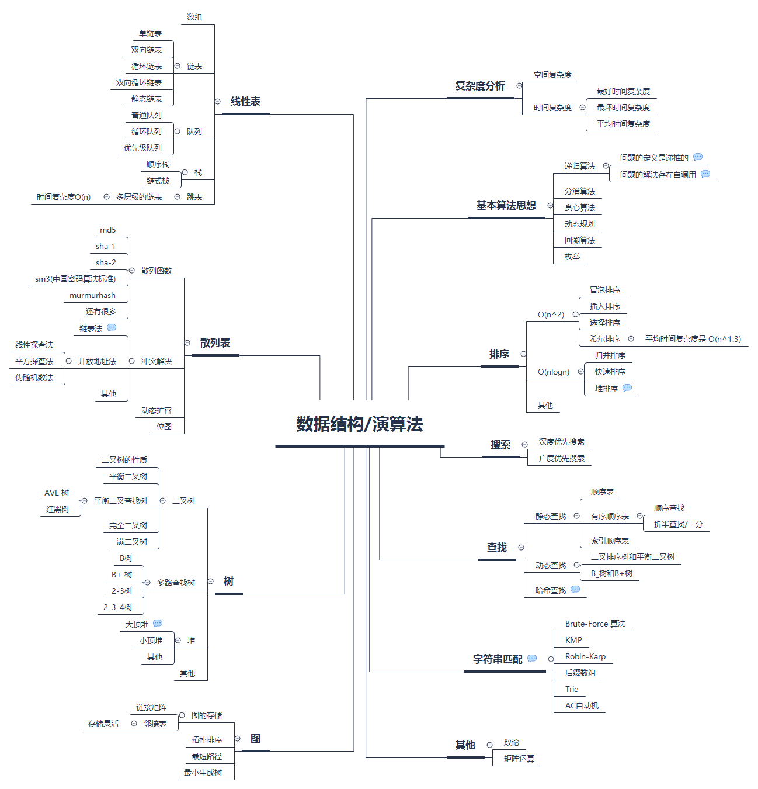

## byte-art

### 数据机构与算法
* 线性表
    1. [数组](linear_list/array)
    2. [链表](linear_list/my_list)
    3. [队列](linear_list/my_queue)
    4. [栈](linear_list/my_stack)
* 树
    1. 二叉树
        * [BST](tree/bst) 
        * [堆-->完全二叉树](my_sort/my_heap_sort)
        * [AVL](tree/avl)
        
    2. 多叉树
        * BTree    
* 图

* 排序算法
    1. [快速排序](my_sort/my_quick_sort)
    2. [堆排序](my_sort/my_heap_sort)
* 查找算法
     1. 二分查找
        * 普通二分查找算法
        * [拉格朗日查找算法](search/lagrange_searh)
     2. map 
     3. 基于树
        * [bst](tree/bst)
        * [avl](tree/avl)
        * [trie](tree/trie/main.go)
        * red-black tree
        * BTree
     4. 基于图
        * 深度遍历
        * 广度遍历
     5. 其他
        * 启发式搜索
* HTTP 
    1. [基于Trie的路由实现](tree/trie/route/main.go)   
    
* 综合运用
    * [LRU缓存策略实现](linear_list/my_list/lru/main.go)         

### 数据库

1. MySQL
    * [MySQL 大纲图](asset/mysql/mysql.svg) 
2. redis

### 错误集合

* stackOverflow
      1. [如何正确验证 golang interface 的 nil](stack_overflow/question/hiding_nil_values.md)