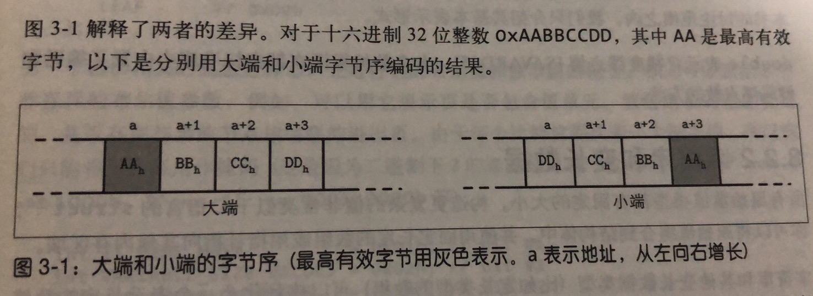

# 文件系统

> 小结: B 树认为是磁盘页的管理机制， B 树的平衡算法需要组合页并在页中移动。需要计算页和指向它们的指针并将它们放在相应的位置。（磁盘数据结构的管理和内存中的有所不同，磁盘中的数据结构操作的是磁盘页，内存中的操作的是字节地址。）

内存数据结构可以利用 CPU 缓存行，预取或者其他硬件相关的特性，用来达到某些优化的目的。实现磁盘数据结构需要关注的东西比内存数据结构多得多。磁盘数据结构必须要自己处理垃圾和碎片的问题。


## 关注的问题 1  
 如何以二进制的形式表示键和数据记录， 如何将多个值组合成更加复杂的结构， 以及如何实现可变长度的数据类型和数组？
 

首先， 键和值都具有某种类型， 比如 integer(整形) 和 string (字符串类型) 都具有可以表示成为二进制形式表示(序列化为二进制和从二进制的形式反序列化)。 
大多数数值类型都用固定大小的值来表示。 当处理多字节数值时， 务必在编解码时使用相同的字节序(byte-order 或者 endianness), 字节序决定了一组字节的先后顺序。

字节序： 
** 大端系统: 
从最高的有效字节开始， 从高位到地位依次排序。 也就是， 最高位有效字节具有最低效地址。
** 小端系统:  
从最低有效地址开始， 从低位到高位依次排序。


 
 数据在内存中的布局和在磁盘中的布局之间的不同: 数据在磁盘中需要考虑数据的存储， 比如使用的是大小端存储。
 
 数据记录由数值，字符串，布尔值之类的原始类型以及他们的组合构成。 但是， 当通过网络传输或者将其保存在磁盘上， 我们只能使用 **字节序列**。这就表示， 如果发送或者写入一条记录时，必须先将其序列化(将记录转换成序列)， 当我们接收或者读取到一条记录时必须先将其序列化(把字节转成成原来的记录) 
 
 ## 原始数值类型
 ### 整型
 1. 一个字节(8个比特)， byte
 2. 两个字节(16比特)， short
 3. 四个字节(32个比特)， int
 4. 8个字节(64个比特)， long 
 
 ## 浮点数
 单精度浮点数
 32 比特位
 第一位是符号位， 1: 表示负数， 0: 表示正数
 
 8 位指数位
 
 23 位表示小数值
 
 
 双精度浮点数
 
 小结: 所有的原始类型都有固定的大小的(占用字节的大小)。
 
 ## 字符串和可变数据
 
 构造复杂的数据类型，需要使用 `struct` 将原始的数据类型组合到结构体中， 并使用固定长度的数组或者指针指向其内存区域。
 
 字符串和其他可变长的数据类型(比如定长类型的数组) 可以序列化为一个表示长度的数值字段的 size 再加上 size 字节， 后面的这些字节实际上数据。 对于字符串来说， 这样的表示形式通常被称为 `UCSD`字符串或者 `Pascal` 字符串。 
 ```c
String {
    size u_int16 
    data byte[size]
}
``` 
pascal 字符串的一种替代是以空(null) 结尾的字符串， 这时，读取的方式逐个字节读出字符串，知道遇到结束符号为止。
这就是表示: 用 `size` 来表示字符串的长度， 用 `data` 表示实际的数据。 好处是: 不用遍历字符串，直接读取出数据的长度。


## 按位打包的数据： 布尔值，枚举和标志

布尔值： 可以使用单个字节来表示， 也可以使用 true 和 false 分别编码表示 0 和 1. 


## 通用的原理
1， 在设计一种文件格式时，首先需要确定寻址方式： 是否要将文件拆分为相同的大小的页，哪些页由单个块或者多个连续块所组成。 大多数原地址更新的块存储结构都使用相同大小的页，从而大大简化了读取和写入访问。仅追加的存储结构通常也是按照页写入数据: 记录被一条一条地追加上去，一旦内存中该页写满了，就将该其刷写到磁盘上。

文件通常以定长的头部开始， 可能以一个定长的尾部结束。 尾部包含需要被快速访问的辅助信息或者解析文件其余所必须的信息。 文件的其余部分被分成多个页。


定长结构存储的优势: 只需使用位置标识符号而不用让每条记录都带上字段名。(节省空间，高效存储，快速读取，)

数据库文件通常由多个部分组成， 并且在该文件的头部，尾部或者另一个单独的一个文件中包含一个查找的查找表，记录了这部分的起始偏移量(参考 kafka 的 index 日志)

