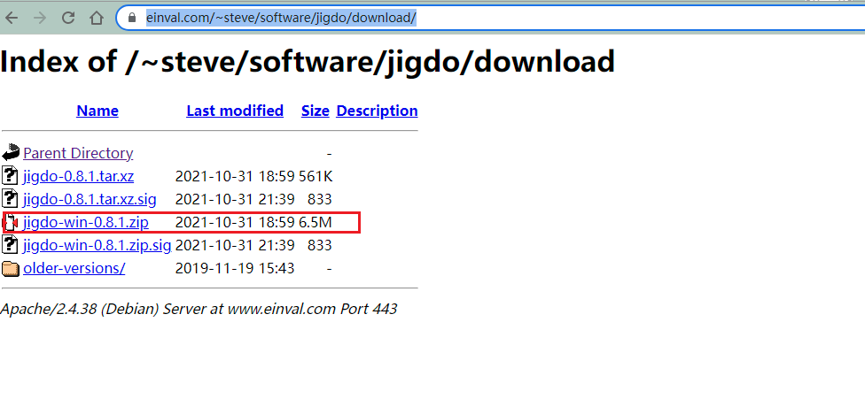
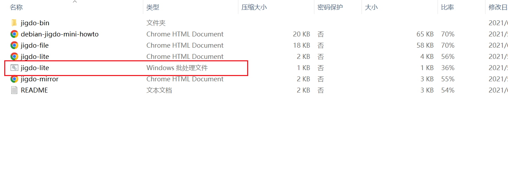
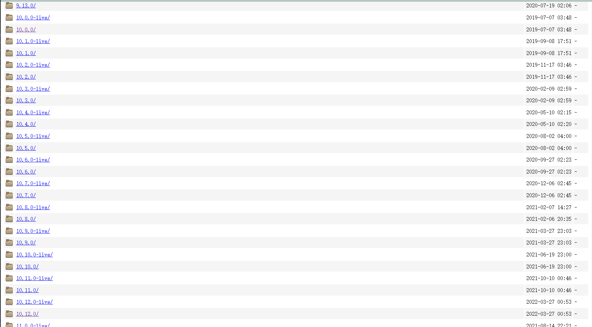
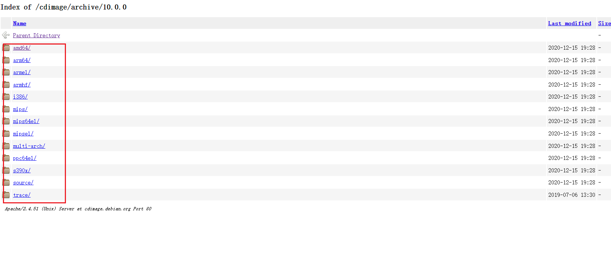
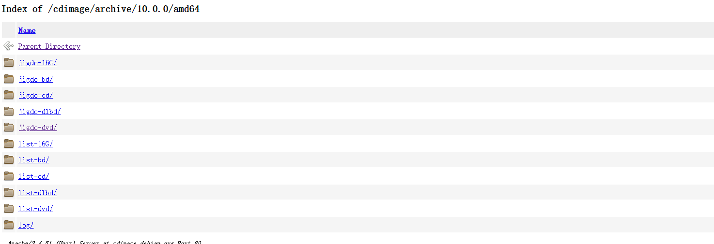
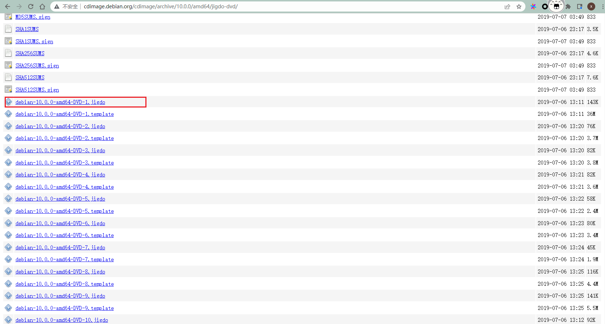
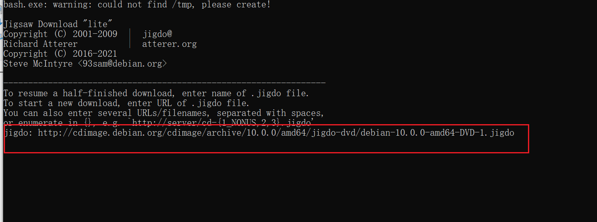
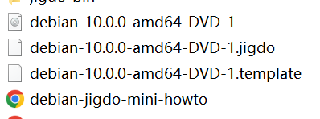

# 使用 jigdo 工具去下载 debian

> 归档的 debian 镜像下载方式

[jidgo 下载链接](https://www.einval.com/~steve/software/jigdo/download/)

[debian 历史归档地址](http://cdimage.debian.org/cdimage/archive/)

以 windows 为例, 演示操作
 这里选择 `win` 平台的版本(目前提供两个平台, win和 linux), 
下载完成之后, 解压, 然后双击 `jigdo-lite.bat` 可执行脚本工具, 然后弹出一个交互式对话框,

找到想要下载镜像的版本, 这里选择 `debian10`

 然后选择处理器平台

选择镜像的类型

然后复制 iso 的镜像地址


在 jidgo 的交互式终端粘贴上刚才复制的地址  然后, 点击回车, 等待下载 `jidgo` 文件, 继续跳过 `scan files`(直接点击回车)
然后, 还需要配置 `mirror` 表示从哪个镜像源开始下载, 这里[选择网易的源](http://mirrors.163.com/debian/)

都配置完成之后, `jidgo-lite-settings.txt` 文本内容如下:

``` shell
jigdo='http://cdimage.debian.org/cdimage/archive/10.0.0/amd64/jigdo-dvd/debian-10.0.0-amd64-DVD-1.jigdo'
debianMirror='http://mirrors.163.com/debian/'
nonusMirror=''
tmpDir='.'
jigdoOpts='--cache jigdo-file-cache.db'
wgetOpts='-nv --passive-ftp --dot-style=mega --continue --timeout=30'
scanMenu=''
filesPerFetch='30'
```

配置完 `mirror` 之久, 就开始下载了.

等待一段时间(, 具体时长依据于自己的网速就)下载完了



## 总结

必备材料
1.[jidgo 下载链接](https://www.einval.com/~steve/software/jigdo/download/)

2.[debian 历史归档地址](http://cdimage.debian.org/cdimage/archive/)
