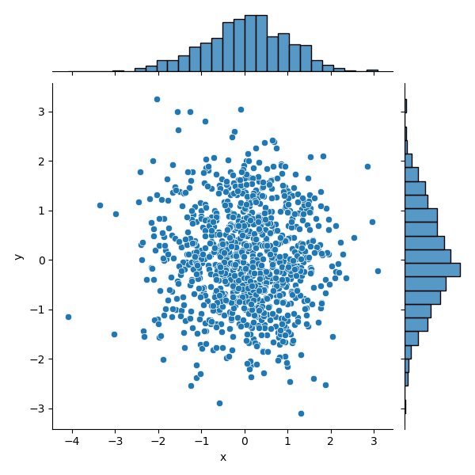

# 数据可视化技术(2)

根据数据之间的关系，数据可视化可以划分为 4 类: 比较，联系，构成和分布

1. 比较: 比较数据间各类别的关系，或者他们随着时间的变化趋势, 比如: 折线图
2. 联系: 查看两个或者两个以上变量之间的关系， 比如: 散点图
3. 构成: 每个部分占整体的百分比，或者随时间变化的百分比， 比如: 饼图
4. 分布: 关注单个变量或者多个变量的分布情况， 比如: 直方图

按照变量的个数, 可视化技术可以划分为: 单变量分析和多变量分析

1. 单变量分析是指一次只关注一个变量而忽略其他的变量(比如: 关注身高的分布情况，考试成绩的分布等)
2. 多变量分析是指在同一张图中可以查看两个或者以上变量的关系: 比如 身高和年龄 这两个参数(特征), 在一张图中是否分析出两个变量之间存在某种关系

常用的图形种类:

1. 散点图(scatter)
2. 折线图(lineplot)
3. 直方图(hist)
4. 条形图(bar)
5. 箱线图(boxplot)
6. 饼图(pie)
7. 热力图(heat map)
8. 蜘蛛图
9. 二变量分布(jointplot)
10. 成对关系(pairplot)

## 散点图

散点图(scatter), 将两个变量的值显示在二位坐标中， 非常适合展示两个变量之间的关系。 二维散点图和三维散点图


``` python

import numpy as np
import pandas as pd
import matplotlib.pyplot as plt
import seaborn as sns

# 数据准备
N = 1000
# 随机生成特征  x
x = np.random.randn(N)
# 随机生成 标签 y
y = np.random.randn(N)
# 用Matplotlib画散点图
plt.scatter(x, y, marker='x')
plt.show()
# 用Seaborn画散点图
df = pd.DataFrame({'x': x, 'y': y})
sns.jointplot(x="x", y="y", data=df, kind='scatter');
plt.show()

```


> 下图为 seaborn 绘制的图形， 除了显示散点图， 还显示变量的分布情况



## 折线图

**折线图可以用来表示数据随着时间的变化的趋势**_

matplotlib 中可以使用 `plt.plot()` 函数来绘制图形, 需要提前把数据按照 X 轴的大小进行排序，要不画出来的折线图就无法按照 X
轴的递增顺序展示

``` python

import pandas as pd
import matplotlib.pyplot as plt
import seaborn as sns

# 数据准备
x = [2010, 2011, 2012, 2013, 2014, 2015, 2016, 2017, 2018, 2019]
y = [5, 3, 6, 20, 17, 16, 19, 30, 32, 35]
# 使用Matplotlib画折线图
plt.plot(x, y)
plt.show()
# 使用Seaborn画折线图
df = pd.DataFrame({'x': x, 'y': y})
sns.lineplot(x="x", y="y", data=df)
plt.show()

```

使用 seaborn 和 matplotlib 绘制的折线图基本没有太的差距


## 直方图

**直方图可以查看数量的分布**__

直方图把**横坐标等分成**一定数量的小区间，这个小区间也叫做箱子，然后在每个箱子内用矩阵条(bar) 展示该箱子数(展示 Y 值)。 这样就完成了数据集直方图的可视化。

``` python

import numpy as np
import pandas as pd
import matplotlib.pyplot as plt
import seaborn as sns

# 数据准备
a = np.random.randn(100)
s = pd.Series(a)
# 用Matplotlib画直方图
plt.hist(s, bins=10)
plt.show()
print("min:", s.min(), ", max:", s.max())
# 用Seaborn画直方图
sns.distplot(s, bins=10, kde=False)
plt.show()
sns.distplot(s, bins=10, kde=True)
plt.show()

```

在 matplotlib 中使用 `plt.hist(x,bins=10)`, 参数 `x` 是一维数组, bins 是箱子的数量(表示将横坐标等分成 10 个)


seaborn 中， 使用 `sns.distplot(x,bins=10,kde=True)` 函数来绘制直方图，其中参数 `x` 是一维数组，`bins` 表示箱子的数量， `kde` i宝石显示核密度函数估计， 默认值为 `True` 


核密度估计通过核函数来估计概率密度

## 条形图

**条形图可以帮助我们查看类别的特征**__

在条形图中， 长条形表示类别的频数，宽度表示类别

在 matplotlib 中可以使用 `plt.bar(x, height)` 函数，其中， `x` 表示 x 轴的序列，`y` 表示数值序列(也就是柱子的高度)

在 seaborn 中使用 `sns.barplot(x=None,y=None,data=Node)` 函数来绘制条形图， 参数 `data` 表示 `DataFrame` 类型， 表示  `x` 和 `y` 是 `data` 中的变量。


``` python

import matplotlib.pyplot as plt
import seaborn as sns
import pandas as pd

# 数据准备
x = ['Cat1', 'Cat2', 'Cat3', 'Cat4', 'Cat5']
y = [5, 4, 8, 12, 7]
# 用Matplotlib画条形图
plt.bar(x, y,)
plt.show()
# 用Seaborn画条形图
sns.barplot(pd.DataFrame({'x': x, 'y': y}), x=x, y=y, )
plt.show()

```


## 箱线图

箱线图又叫做盒式图， 在 1977 年被提出， 箱形图由五个数值组成: 最大值(max), 最小值(min), 中位数(median), 和 上下四分位数(Q3， Q1). 

箱线图可以帮助我们分析数据的差异，离散程度和异常值


``` python

import seaborn as sns
import pandas as pd
import matplotlib.pyplot as plt
import numpy as np

# 数据准备
# 生成10*4维度数据
data = np.random.normal(size=(10, 4))
labels = ['A', 'B', 'C', 'D']
# 用Matplotlib画箱线图
plt.boxplot(data, labels=labels)
plt.show()
# 用Seaborn画箱线图
df = pd.DataFrame(data, columns=labels)
sns.boxplot(data=df)
plt.show()

```

在 matplotlib 中使用 `plt.boxplot(x, labels=None)` 其中参数 `x` 是我们需要绘制的箱线图的数据， `labels` 是缺省值， 可以为箱线图添加标签。

在 seaborn 中，我们可以使用 `sns.boxplot(x=None, y = Node, data=None)` 函数来绘制， `x` 是 x 轴,`y`,`data` 是 DataFrame 数据。


## 饼图

饼图是用于统计学模块中, 可以显示每个部分大小与总和的比例。

在 matplotlib 中使用 `plt.pie(x,labels=None)` 函数进行绘制图形。其中 `x` 表示需要绘制的数据， `labels` 是缺省值，可以为饼图添加标签。

```python

import matplotlib.pyplot as plt

# 数据准备
# nums 代表这些学历对应的人数
nums = [25, 37, 33, 37, 6]
# 分别代表高中、本科、硕士、博士和其他几种学历的分类标签
labels = ['High-school', 'Bachelor', 'Master', 'Ph.d', 'Others']
# 用Matplotlib画饼图
plt.pie(x=nums, labels=labels, autopct="%.2f")
plt.show()

```


## 热力图

热力图是一种非常直观的多元变量分析方法。 可以分析变量之间的关系

热力图，英文叫 heat map，是一种矩阵表示方法，其中矩阵中的元素值用颜色来代表，不同的颜色代表不同大小的值。通过颜色就能直观地知道某个位置上数值的大小。另外你也可以将这个位置上的颜色，与数据集中的其他位置颜色进行比较。

在 seaborn 中使用 `sns.heatmap(data)` 函数进行绘制， data 表示需要绘制的数据(**一般是各个变量之间的相关性系数**)

这里我们使用 Seaborn 中自带的数据集 flights，该数据集记录了 1949 年到 1960 年期间，每个月的航班乘客的数量

``` python

import matplotlib.pyplot as plt
import seaborn as sns

# 数据准备
flights = sns.load_dataset("flights")
data = flights.pivot('year', 'month', 'passengers')
# 用Seaborn画热力图
sns.heatmap(data, cmap='YlGnBu')
plt.show()

```

通过 seaborn 的 heatmap 函数，我们可以观察到不同年份，不同月份的乘客数量变化情况，其中颜色越深的代表乘客数量越多，如下图所示：


## 蜘蛛图

蜘蛛图是一种用于显示一对多关系的方法。 在蜘蛛图中， 一个变量相对于另一个变量的显著性的清晰可见的。

下面是王者荣耀玩家的战斗力图: 指标有: 推进，KDA, 生存，团战，发育和输出。

这里我们需要使用 Matplotlib 来进行画图，首先设置两个数组：labels 和 stats。他们分别保存了这些属性的名称和属性值。

因为蜘蛛图是一个圆形，你需要计算每个坐标的角度，然后对这些数值进行设置。当画完最后一个点后，需要与第一个点进行连线。

``` python
import numpy as np
import matplotlib.pyplot as plt
import matplotlib as mpl
from matplotlib.font_manager import FontProperties  # 导入FontProperties

mpl.rcParams['font.family'] = 'SimHei'
plt.rcParams['axes.unicode_minus'] = False  # 步骤二（解决坐标轴负数的负号显示问题）
font = FontProperties(fname="SimHei.ttf", size=14)  # 设置字体
# 数据准备
labels = np.array([u"推进", "KDA", u"生存", u"团战", u"发育", u"输出"])
stats = [83, 61, 95, 67, 76, 88]
# 画图数据准备，角度、状态值
angles = np.linspace(0, 2 * np.pi, len(labels), endpoint=False)

fig = plt.figure()
ax = fig.add_subplot(111, polar=True)
ax.plot(angles, stats, 'o-', linewidth=2)
ax.fill(angles, stats, alpha=0.25)

ax.set_thetagrids(angles * 180 / np.pi, labels)
plt.show()

```


## 二元变量分布

如果我们想要看两个变量之间的关系，就需要用到二元变量分布。当然二元变量分布有多种呈现方式，开头给你介绍的散点图就是一种二元变量分布。

在 Seaborn 里，使用二元变量分布是非常方便的，直接使用 sns.jointplot(x, y, data=None, kind) 函数即可。其中用 kind 表示不同的视图类型：“kind='scatter'”代表散点图，“kind='kde'”代表核密度图，“kind='hex' ”代表 Hexbin 图，它代表的是直方图的二维模拟。

``` python

import matplotlib.pyplot as plt
import seaborn as sns

# 数据准备
tips = sns.load_dataset("tips")
print(tips.head(10))
# 用Seaborn画二元变量分布图（散点图，核密度图，Hexbin图）
sns.jointplot(x="total_bill", y="tip", data=tips, kind='scatter')
sns.jointplot(x="total_bill", y="tip", data=tips, kind='kde')
sns.jointplot(x="total_bill", y="tip", data=tips, kind='hex')
plt.show()

```

这里我们使用 Seaborn 中自带的数据集 tips，这个数据集记录了不同顾客在餐厅的消费账单及小费情况。代码中 total_bill 保存了客户的账单金额，tip 是该客户给出的小费金额。我们可以用 Seaborn 中的 jointplot 来探索这两个变量之间的关系。


## 成对关系

如果想要探索数据集中的多个成对双变量的分布，可以直接采用 sns.pairplot() 函数。它会同时展示出 DataFrame 中每对变量的关系，另外在对角线上，你能看到每个变量自身作为单变量的分布情况。它可以说是探索性分析中的常用函数，可以很快帮我们理解变量对之间的关系。

pairplot 函数的使用，就像在 DataFrame 中使用 describe() 函数一样方便，是数据探索中的常用函数。

这里我们使用 Seaborn 中自带的 iris 数据集，这个数据集也叫鸢尾花数据集。鸢尾花可以分成 Setosa、Versicolour 和 Virginica 三个品种，在这个数据集中，针对每一个品种，都有 50 个数据，每个数据中包括了 4 个属性，分别是花萼长度、花萼宽度、花瓣长度和花瓣宽度。通过这些数据，需要你来预测鸢尾花卉属于三个品种中的哪一种。

下面这张图相当于这 4 个变量两两之间的关系。比如矩阵中的第一张图代表的就是花萼长度自身的分布图，它右侧的这张图代表的是花萼长度与花萼宽度这两个变量之间的关系。


## 常用的工具(python)


