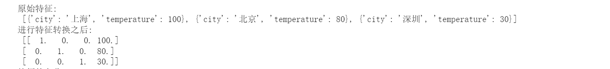

# 字典特征提取

实验环境

``` tex
certifi==2021.5.30
numpy==1.19.5
pandas==1.1.5
python-dateutil==2.8.2
pytz==2022.7.1
scikit-learn==0.19.1
scipy==1.5.4
six==1.16.0
```

使用 sklearn 中的 `DictVectorizer` 对字典特数据进行特征值化

参数说明

1. `DictVectorizer.fit_transform`  参数是字典或者字典迭代器， 返回值是 sparse 矩阵
2. `dict_vector.inverse_transform()` array 数组或者 sparse 矩阵， 返回转换之前的数据

> 常规的二维矩阵(3,4) 

``` text
[[  1.   0.   0. 100.]
 [  0.   1.   0.  80.]
 [  0.   0.   1.  30.]]
```

稀疏矩阵(使用坐标来表示矩阵的非零值)的表示: 具体的定义可以 百度搜索 稀疏矩阵(节省矩阵的存储空间)

(0, 3)	100.0 第 0 行和第 3 列的值为 100.0 

(1, 1)	1.0  第 1 行和第 1 列的值为 1.0

``` tex
   (0, 0)	1.0
  (0, 3)	100.0
  (1, 1)	1.0
  (1, 3)	80.0
  (2, 2)	1.0
  (2, 3)	30.0
```



``` python

# 导入 pandas
import pandas as pd
# 导入字典特征抽取器
from sklearn.feature_extraction import DictVectorizer

# 实例化 字典特征抽取对象, sparse=True 表示返回的是稀疏矩阵
transfer = DictVectorizer(sparse=False)

# 字典数据
# 其中 city 的值不是数值类型的， 因此需要使用特征转换
data = [
    {'city': '上海', 'temperature': 100},
    {'city': '北京', 'temperature': 80},
    {'city': '深圳', 'temperature': 30},
]

print("原始特征:\n", data)
# 特征抽取, 返回的是二维矩阵
data_new = transfer.fit_transform(data)

print("进行特征转换之后:\n", data_new)

print("特征的名称:\n", transfer.get_feature_names())

df = pd.DataFrame(data_new, columns=transfer.get_feature_names())
print("构建的 DataFrame:\n", df)

print(transfer.inverse_transform(df.values))

# 初始化字典特征转换器示例，返回的是稀疏矩阵
transfer = DictVectorizer()
# 进行数据转换
data_new = transfer.fit_transform(data)

print("稀疏矩阵:\n", data_new)

# 还原转换之后的数据
print("转换之后的数据:\n", transfer.inverse_transform(data_new))

```

转换之后，一个特征的名字可以变成多个， 所以需要使用

``` python
# 使用 DictVectorizer 字典向量化的对象获取转换的特征名称
transfer.get_feature_names() 
```


``` tex
特征的名称:
 ['city=上海', 'city=北京', 'city=深圳', 'temperature']
```

