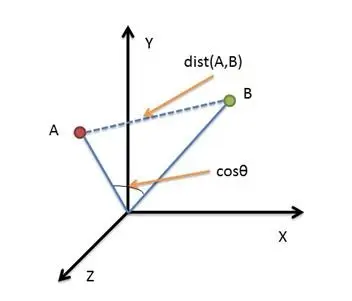

# 使用 python 计算欧式距离

欧氏距离是最容易直观理解的距离度量方法，我们小学、初中和高中接触到的两个点在空间中的距离一般都是指欧氏距离。

解析如下



二维平面上点$a(x_1,y_1)$与$b(x_2,y_2)$间的欧氏距离

$$d_{ab}=\sqrt{(x_1 + x_2)^2+(y_1+y_2)^2}$$

三维空间点 $a(x_1,y_1,z_1)$ 与 $b(x_2,y_2,z_2)$ 间的欧氏距离

$$d_{ab} = \sqrt{(x_1-x_2)^2 + (y_1-y_2)^2 + (z_1-z_2) ^ 2}$$

> 使用 python 计算欧式距离

``` python

import numpy as np


def call_euclidean(x, y):
    # 计算欧式距离
    return np.sqrt(np.sum(np.square(x - y)))


# 生成十个等差数据
x = np.linspace(2, 11, 10)
y = np.linspace(1, 10, 10)
# 计算欧式距离
d = call_euclidean(x, y)
print(d)
print(x)
print(y)
print(x - y)
```
