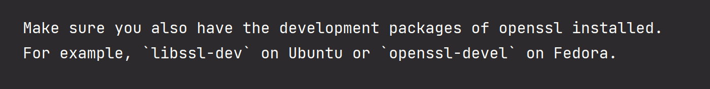

# rust 编译 `openssl-sys v0.9.80`

> centos 7 环境编译 `openssl-sys` 报错

``` text
 run pkg_config fail: "`\"pkg-config\" \"--libs\" \"--cflags\" \"openssl\"` did not exit successfully: exit status: 1\nerror: could not find system library 'openssl' required by the 'openssl-sys' crate\n\n--- stderr\nPackage openssl was not found in the pkg-config search path.\nPerhaps you should add the directory containing `openssl.pc'\nto the PKG_CONFIG_PATH environment variable\nNo package 'openssl' found\n"

  --- stderr
  thread 'main' panicked at '

  Could not find directory of OpenSSL installation, and this `-sys` crate cannot
  proceed without this knowledge. If OpenSSL is installed and this crate had
  trouble finding it,  you can set the `OPENSSL_DIR` environment variable for the
  compilation process.

  Make sure you also have the development packages of openssl installed.
  For example, `libssl-dev` on Ubuntu or `openssl-devel` on Fedora.

  If you're in a situation where you think the directory *should* be found
  automatically, please open a bug at https://github.com/sfackler/rust-openssl
  and include information about your system as well as this message.

  $HOST = x86_64-unknown-linux-gnu
  $TARGET = x86_64-unknown-linux-gnu
  openssl-sys = 0.9.80

```

根据错误提示， ` Make sure you also have the development packages of openssl installed.
  For example, `libssl-dev` on Ubuntu or `openssl-devel` on Fedora.`

安装 `openssl-sys` 需要安装 `openssl-devel 或者 libssl-dev ` 



由于所在的机器是 centos

``` shell
sudo yum install -y libssl-dev 
```

然后再重新编译

``` shell
cargo build
```
