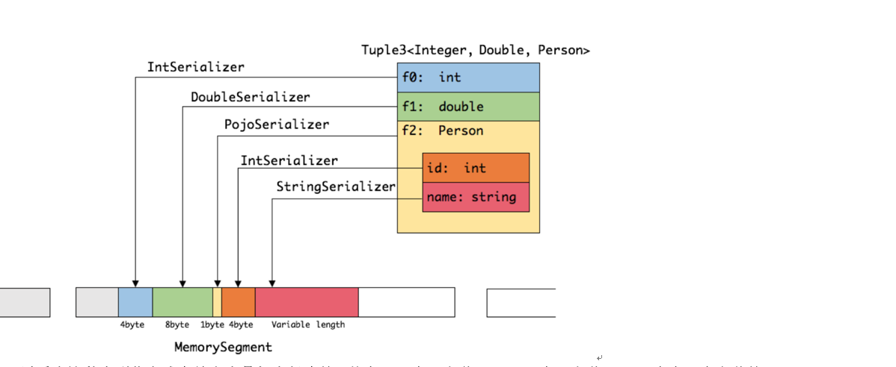
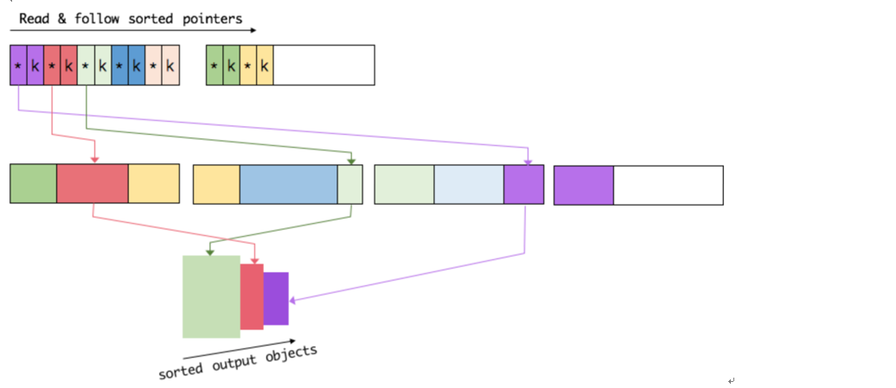
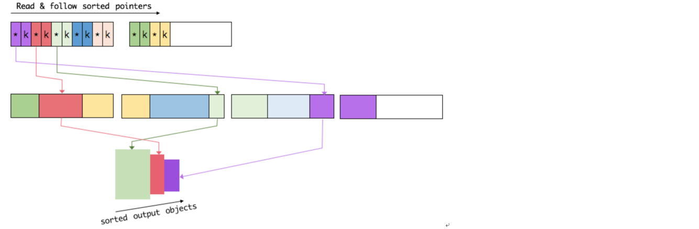
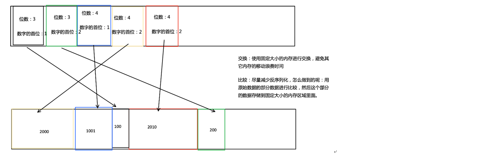

# 什么是 flink 

这里主要是简单介绍 flink 是什么， 有什么用，一般应用于什么场景

## flink 是什么

> Apache Flink 是一个框架和分布式处理引擎，用于在*无边界和有边界*数据流上进行有状态的计算。Flink 能在所有常见集群环境中运行，并能以内存速度和任意规模进行计算。

概括一下意思大概是: flink 是一个用于处理数据流计算的分布式引擎。flink 能以内存为基础进行任意规模的数据处理。

## flink 擅长处理的数据

其中说到无边界和有边界数据流：

1. **无界流** 有定义流的开始，但没有定义流的结束。它们会无休止地产生数据。无界流的数据必须持续处理，即数据被摄取后需要立刻处理。我们不能等到所有数据都到达再处理，因为输入是无限的，在任何时候输入都不会完成。处理无界数据通常要求以特定顺序摄取事件，例如事件发生的顺序，以便能够推断结果的完整性。
2. **有界流** 有定义流的开始，也有定义流的结束。有界流可以在摄取所有数据后再进行计算。有界流所有数据可以被排序，所以并不需要有序摄取。有界流处理通常被称为批处理

> 总结: 有界流就是定义了开始和结束的数据(典型的代表是: 处理一批归档的数据)，无界流是: 定义了开始，但是没有定义结束的数据(典型的代表是: 淘宝双11实时统计成交额的大屏，汽车物联网产生源源不断产生的数据)

## 应用部署

1. k8s
2. yarn
3. standalone 

## 应用特点

1. 流批一体的数据处理引擎
2. 基于 DataFlow 的数据流编程模型
3. 支持不同的时间语义(事件产生时间，事件摄取时间，事件被处理时间)下的窗口(时间，滑动，会话，翻滚，以及自定义触发)事件
4. 支持有 Exactly-once 语义的容错保证
5. 支持轻量级的分布式快照机制实现的容错
6. 支持 savepoint 机制，需要手动触发，一般用于应用升级等场景
7. 自动反压机制
8. 自定义内存管理机制(MemorySegment )
9. 支持 k8s, YARN 方式部署
10. 堆内内存和堆外内存机制
11. 定制的序列化框架 
12. 支持的数据类型比较多， BasicTypeInfo, BasicArrayTypeInfo, WritableTypeInfo, TupleTypeInfo,CaseClassTypeInfo, PojoTypeInfo, GenericTypeInfo 类型

### 支持的数据类型

1. BasicTypeInfo 任意的 java 基本装箱类型或者 String 类型

2. BasicArrayTypeInfo 任意的 java 基本装箱数组类型或者 String 数组类型

3. WritableTypeInfo hadoop Writeable 接口实现

4. TupleTypeInfo 支持 Tuple1 到 Tuple25 的元组类型

5. CaseClassTypeInfo Scala CaseClass 类型

6. PojoTypeInfo 任意的 POJO 类型， 比如 java 对象的所有成员变量， public 修饰符或者有 getter/setter 方式的成员

7. GenericTypeInfo 任意无法匹配之前那集中类型的类

   

   对于前面的六种，Flink 可以自动地生成对应的 TypeSerializer, 非常高效地对数据进行序列化和反序列化。

   对于 GenericTypeInfo  类型， Flink 使用 Kryo 进行序列化和反序列化。 每个 TypeInoformation 中，都包含了 serializer(序列化信息)。 类型会自动通过 serializer 进行序列化， 然后使用 java unsave 接口写入 MemorySegments(flink 封装的内存块)。

   

## 自定义排序逻辑

> 对于定长的使用 key 保存，（ 对于不定长的采用二级指针的方式，真正的数据保存在第一个区域）， key 和指针保存在第二个区域

Flink 把 sort buffer 分成两个区域。 一个区域用来保存所有对象的二进制数据。 另外一个区域用来保存指向完整二进制数据的指针和定长序列化之后的 key,也就是保存 key 和 pointer。如果需要序列化的 key 是一个边长类型的， 比如 String 类型，会取前缀序列化。当一个对象要加到 sort buffer 里面时， 它的二进制数据会被加载到第一个区域， 指针(可能还有 key 定长的数据)会被加载到第二个区域。

将实际的数据，(指针和定长的 key ) 分开存放的目的是：

第一： 交换定长的(key+pointer) 更加高效， 不用交换真实的数据也不用移动其他的 key 和 pointer。 

第二： 这样对于缓存更加友好， 因为 key 都是连续存储在内存中的， 这对于提高了 CPU 的缓存命中率。

排序主要是通过先比较大小然后交换。Flink 的排序过程中， 会先用 Key 来比较大小， 如果 key 相同， 或者没有 key 时， 这个时候就需要把真正的二进制数据反序列化出来， 然后再做比较。 之后只需要交换 key 和 pointer 就能够完成排序。 真正的二进制数据可以不用移动。

访问已经排好顺序的数据时，根据 key 读取到定长的数据， 然后通过 pointer 读取到不定长的数据， 这样就能把已经排序好的数据写回到内存或者外部存储了。

小结: 

1. Flink 将 sort buffer 划分为两个区域，一个区域用户保存定长的 key 和指针，另一个区域用于保存不定长的真正数据
2. Flink 排序过程中， 首先比较定长的 key, 如果定长的 key 相同或者没有定长的 key 时， 会将不定长的 数据通过指针的方式反序列化出来再进行比较
3. 交换过程通过交换定长的 key 和 指针， 不交换不定长的数据
4. 排序完成后，顺序访问数据，通过指针的来访问不定长的数据，然后将排序的结果返回

这样处理排序的优势: 

1. 交换定长的块和指针比交换所有的数据更加高效
2. 有利于 CPU 缓存的命中率

## 参考

1. [Apache Flink](https://flink.apache.org/zh/flink-architecture.html)
2. [Flink 数据类型与序列化](https://www.jianshu.com/p/211d1f22aaae)