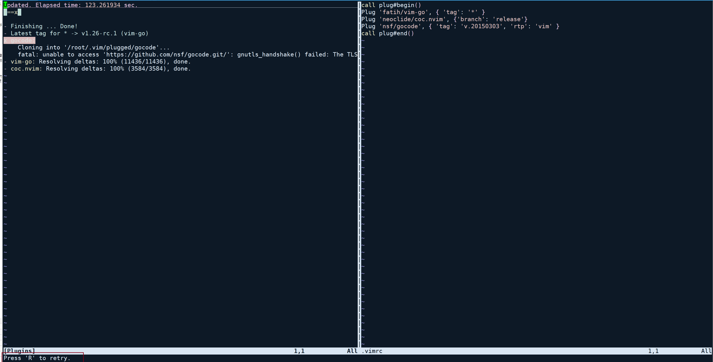
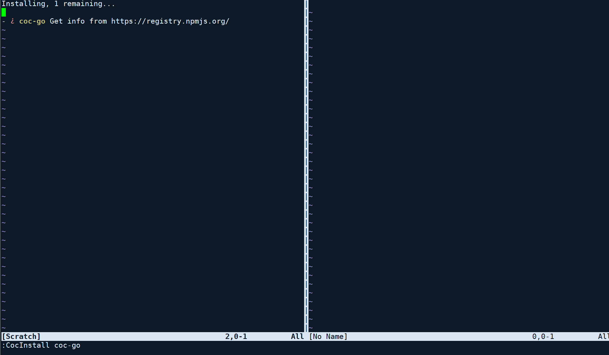
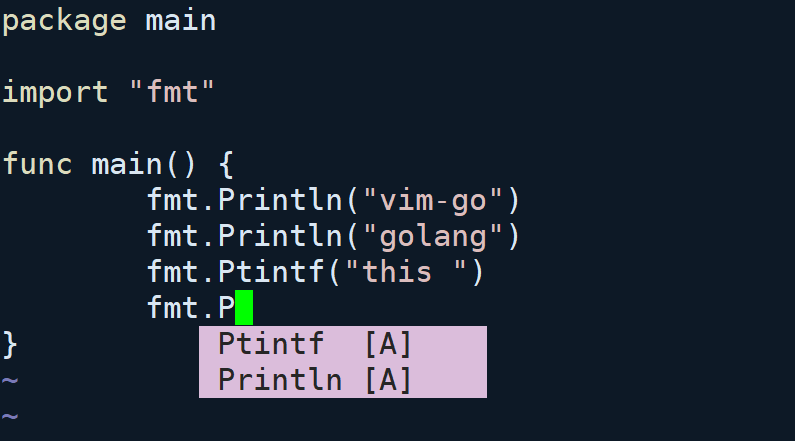

# vim 开发环境配置

> 以 go 开发环境为例
> 一开始只是仰慕精通 vim 的专家们, 后来才发现 vim 是真的好用

前置条件:

1. 更新软件源
2. git 需要提前安装
3. nodejs
4. [ubuntu 环境安装 go](https://github.com/golang/go/wiki/Ubuntu)
5. [插件管理 vim-plug](https://github.com/junegunn/vim-plug)
6. [代码自动补全 coc-nvim](https://github.com/neoclide/coc.nvim)

## 准备阶段

### 更新软件源

```shell
# 替换 ubuntu 原来的源到 aliyun
cp /etc/apt/sources.list /etc/apt/sources.list.bak
sed -i -E 's/http:\/\/(archive|security).ubuntu.com/[trusted=yes] http:\/\/mirrors.aliyun.com/g' /etc/apt/sources.list
apt-get udpate
```

### 安装 git

```shell

apt install git -y
```

### 更新或者安装 nodejs

```shell
# 下载并执行下载 nodejs 的版本
curl -fsSL https://deb.nodesource.com/setup_12.x | sudo -E bash -
# 执行安装
sudo apt-get install -y nodejs
```

### vim-plug 环境

```shell
curl -fLo ~/.vim/autoload/plug.vim --create-dirs https://raw.githubusercontent.com/junegunn/vim-plug/master/plug.vim
```

(国内用户)如果执行上面这一步失败, 那么可以执行这一步操作

```shell
cd ~ \
 && mkdir -p ~/.vim/autoload/ \
 && git clone https://github.com/junegunn/vim-plug.git \
 && cp vim-plug/plug.vim ~/.vim/autoload/plug.vim
```

如果 github 因为网速原因克隆失败, 尝试使用[加速地址](https://github.91chi.fun/https://github.com/junegunn/vim-plug.git)

```shell
 cd ~ \
 && mkdir -p ~/.vim/autoload/ \
 && git clone https://github.91chi.fun/https://github.com/junegunn/vim-plug.git \
 && cp vim-plug/plug.vim ~/.vim/autoload/plug.vim
```

### 修改 `~/.vimrc` 文件

使用 `vim ~/.vimrc` 修改文件, 加入如下的内容

```shell
call plug#begin()
Plug 'fatih/vim-go', { 'tag': '*' }
Plug 'neoclide/coc.nvim', {'branch': 'release'}
Plug 'nsf/gocode', { 'tag': 'v.20150303', 'rtp': 'vim' }
call plug#end()
```

如果有需要, 可能还需要加入 `nerdtree`, vim 的终端文件夹插件

```shell
Plug 'scrooloose/nerdtree', { 'on':  'NERDTreeToggle' }
```

修改完成后, 保存 `:w` 然后立即执行 `:source ~/.vimrc` 或者保存之后, 重新使用 vim 打开文件

### 安装插件

重新打开 vim 之后, 在 `normal` 模式下, 输入 `:PlugInstall`

途中可能会遇到失败, 这里只能 `R` 重试了



如果还是失败, 那么, 需要手动将插件下载到 `~/.vim/plugged` 这个目录下了,
以 `gocode` 为例

```shell
cd ~/.vim/plugged/ && https://github.com/nsf/gocode.git
```

### 在 vim 中使用, `GoInstallBinaries` 补全命令


### coc 命令补全, `CocInstall coc-go`



## 重新使用 vim

重新感受一下 vim


