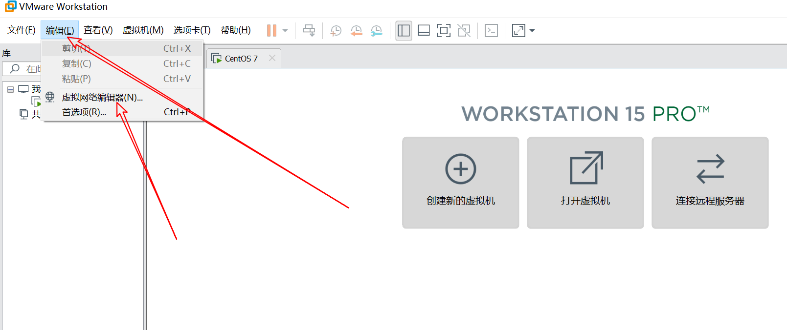
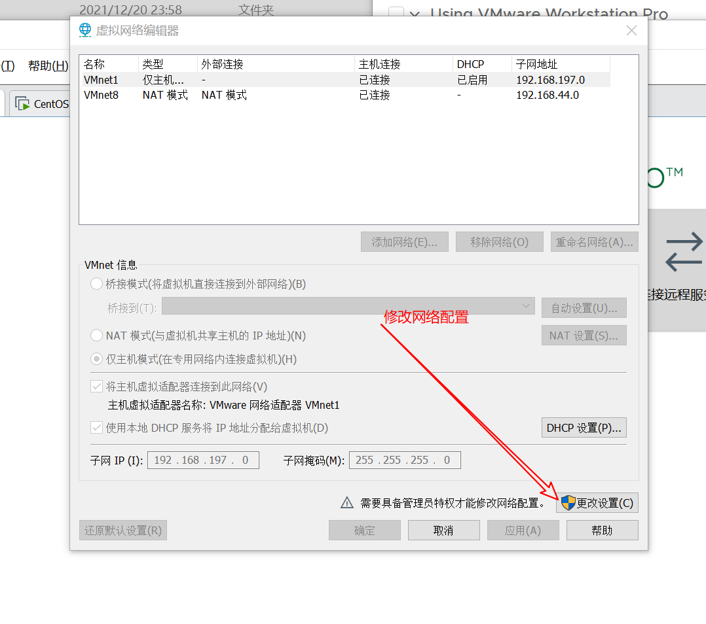
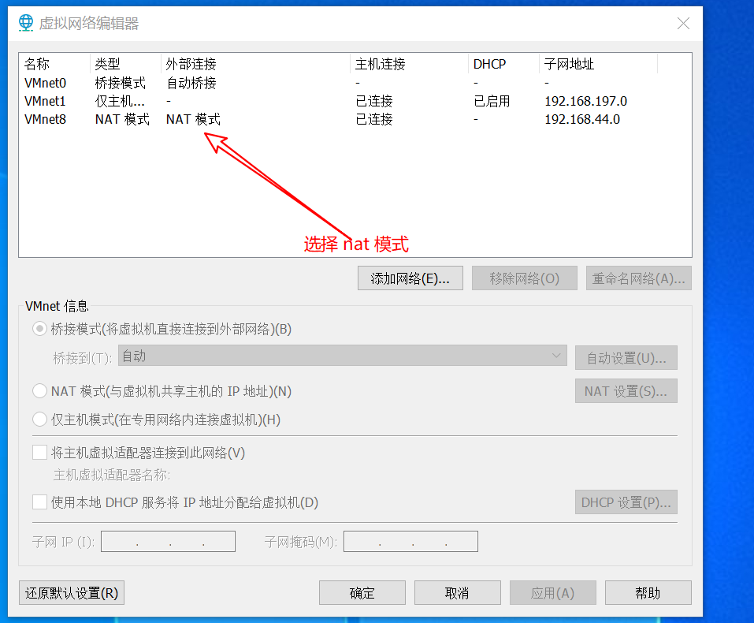
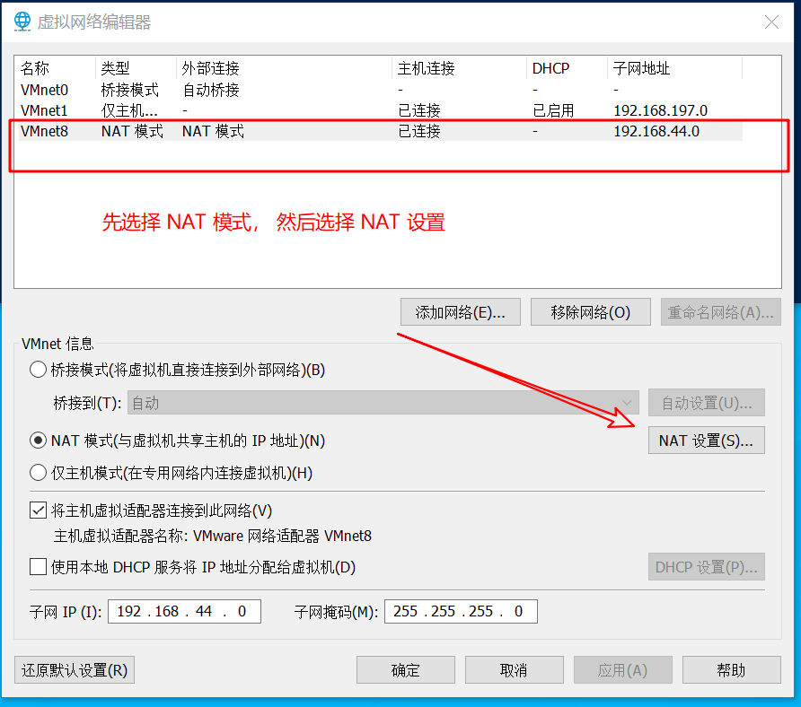
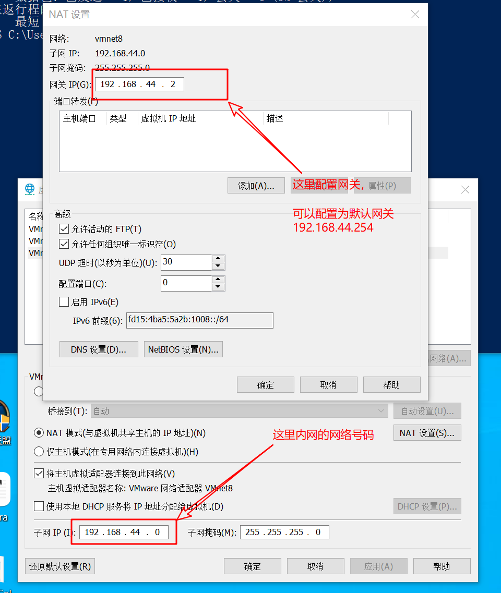
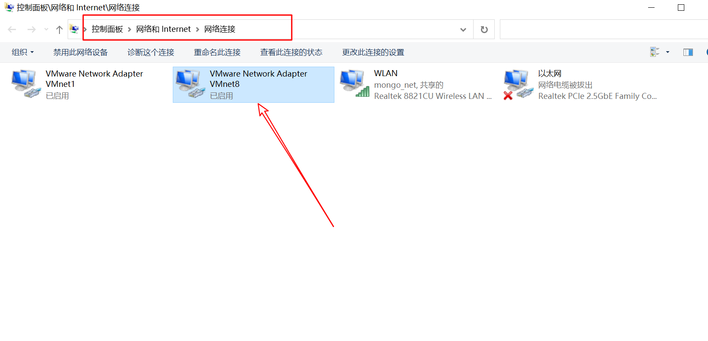
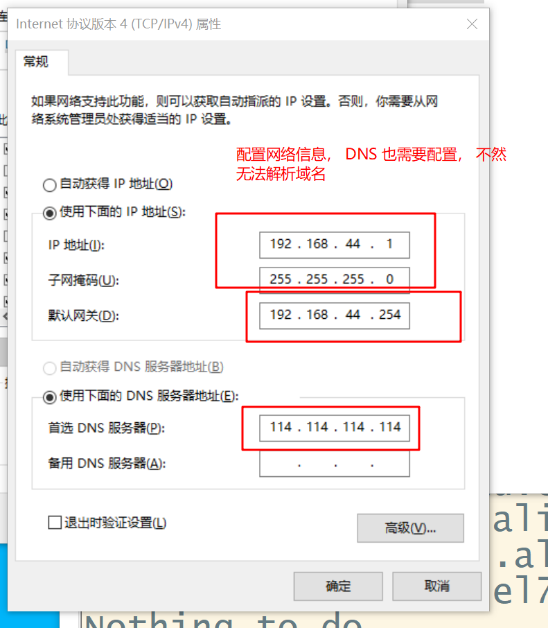

# vmware 固定 ip 地址

1. 设置网络编辑器，




2. 修改 net 模式的网络配置

   

3. 选择 nat 模式

   


4. 进入 NAT 设置

   

5. 配置 nat 模式的网关

   

6. 配置网卡

   

7. 修改网卡的网络配置

   

8. 配置网卡的网络信息

   

9. 编辑网络信息

   


```shell
vim /etc/sysconfig/network-scripts/ifcfg-ens33
```


```shell
TYPE="Ethernet"
PROXY_METHOD="none"
BROWSER_ONLY="no"
# BOOTPROTO="dhcp" # 这一行需要注释掉
BOOTPROTO="static" # 这里改为静态地址， 
DEFROUTE="yes"
IPV4_FAILURE_FATAL="no"
IPV6INIT="yes"
IPV6_AUTOCONF="yes"
IPV6_DEFROUTE="yes"
IPV6_FAILURE_FATAL="no"
IPV6_ADDR_GEN_MODE="stable-privacy"
NAME="ens33"
UUID="7192fe8d-684f-49ef-a12b-b4c512edc2c2"
DEVICE="ens33"
ONBOOT="yes"
IPV6_PRIVACY="no"

# 下面这里新加入的内容
IPADDR="192.168.44.100" # 这里表示 ip 地址
NETMASK="255.255.255.0" # 这里是子网掩码
GATEWAY="192.168.44.254" # 这个是默认的网关
DNS1="114.114.114.114" # 这个是配置的 DNS 服务器地址
```


重启网卡

```shell
service network restart
```

测试网络的连通性:

```shell
ping www.baidu.com
```

能 ping 通， 表示配置成功
