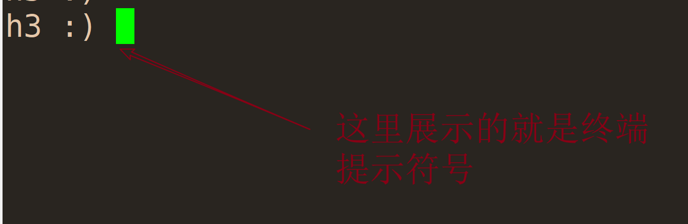

# clickhouse 服务端配置说明

## \_

### 文本日志配置

> 具体的日志等级, 日志路径, 日志分割大小, 保留日志的个数, 日志格式配置

```xml
<logger>
    <!-- info 级别的日志 -->
    <level>information</level>
    <!-- 常规日志路径 -->
    <log>/var/log/clickhouse-server/clickhouse-server.log</log>
    <!-- 错误日志路径 -->
    <errorlog>/var/log/clickhouse-server/clickhouse-server.err.log</errorlog>
    <!-- 日志分割-日志文件大小 -->
    <size>1000M</size>
    <!-- 保留日志文件的个数 -->
    <count>10</count>
    <!-- json 格式日志-->>
    <formatting>json</formatting>
</logger>
```

### http 跨域配置

> 跨域配置需要根据具体的情况来进行配置

```xml
<http_options_response>
    <header>
        <name>Access-Control-Allow-Origin</name>
        <value>*</value>
    </header>
    <header>
        <name>Access-Control-Allow-Headers</name>
        <value>origin, x-requested-with</value>
    </header>
    <header>
        <name>Access-Control-Allow-Methods</name>
        <value>POST, GET, OPTIONS</value>
    </header>
    <header>
        <name>Access-Control-Max-Age</name>
        <value>86400</value>
    </header>
</http_options_response>
```

### 命令行终端提示符号

> 根据需要配置



```xml
<display_name>h3</display_name>
```

### http 交互端口配置

> ODBC 和 JDBC 的驱动(比如: DataGrip, Dbeaver, ...)和大多数 (embedded UI, Grafana, Redash, ...)

```xml
<http_port>8123</http_port>
```

### tcp 协议端口配置

> 使用纯 tcp 协议进行交互时需要配置

```xml
<tcp_port>9000</tcp_port>
```

### postgres 协议端口配置

> 使用 postgres 协议进行交互时需要配置

```xml
<postgresql_port>9005</postgresql_port>
```

### https 端口配置

> 相关联证书配置

```xml
<https_port>8443</https_port>
```

### tcp + tls 协议端口配置

> 基于 TLS 之上的 tcp 协议交互

```xml
<tcp_port_secure>9440</tcp_port_secure>
```

### tcp 代理端口

>

```xml
<tcp_with_proxy_port>9011</tcp_with_proxy_port>
```

### 集群副本之间的通信端口

```xml
<interserver_http_port>9009</interserver_http_port>
```

### 集群副本之间的安全通信端口

```xml
<interserver_https_port>9010</interserver_https_port>
```

### 集群内部通信地址

```xml
<interserver_http_host>example.clickhouse.com</interserver_http_host>
```

### 集群之间的安全认证配置

```xml
<interserver_http_credentials>
    <user>interserver</user>
    <password></password>
</interserver_http_credentials>
```

### 监听网络地址

```xml
<!--ipv6 配置-->
<listen_host>::1</listen_host>
<!--ipv4 配置-->
<listen_host>127.0.0.1</listen_host>
```

### 当监听的网络不可达时, 尝试的次数

> 默认不尝试重新监听

```xml
<listen_try>0</listen_try>
```

### 允许多个服务监听的同一个端口

```xml
<listen_reuse_port>0</listen_reuse_port>
```

### backlog 配置

tcp backlog 的大小

```xml
<listen_backlog>4096</listen_backlog>
```

### 最大链接数配置

```xml
<max_connections>4096</max_connections>
```

### 链接超时

默认配置 3 分钟

```xml
<keep_alive_timeout>3</keep_alive_timeout>
```

### grpc 端口配置

```xml
<grpc_port>9100</grpc_port>
```

```xml
<grpc>
    <!-- 是否开启 ssl 协议-->
    <enable_ssl>false</enable_ssl>

    <!--  配置 ssl 是, 公钥和私钥的证书路径配置 -->
    <ssl_cert_file>/path/to/ssl_cert_file</ssl_cert_file>
    <ssl_key_file>/path/to/ssl_key_file</ssl_key_file>

    <!-- Whether server will request client for a certificate -->
    <ssl_require_client_auth>false</ssl_require_client_auth>

    <!-- The following file is used only if ssl_require_client_auth=1 -->
    <ssl_ca_cert_file>/path/to/ssl_ca_cert_file</ssl_ca_cert_file>

    <!-- 压缩算法 none, deflate, gzip, stream_gzip -->
    <transport_compression_type>none</transport_compression_type>

    <!-- 压缩等级, 可以配置值为 0, 1, 2, 3 -->
    <transport_compression_level>0</transport_compression_level>

    <!-- Send/receive message size limits in bytes. -1 means unlimited -->
    <max_send_message_size>-1</max_send_message_size>
    <max_receive_message_size>-1</max_receive_message_size>

    <!-- Enable if you want very detailed logs -->
    <verbose_logs>false</verbose_logs>
</grpc>
```

### openssl 配置

```xml
<!-- Used with https_port and tcp_port_secure. Full ssl options list: https://github.com/ClickHouse-Extras/poco/blob/master/NetSSL_OpenSSL/include/Poco/Net/SSLManager.h#L71 -->
<openSSL>
    <server> <!-- Used for https server AND secure tcp port -->
        <!-- openssl req -subj "/CN=localhost" -new -newkey rsa:2048 -days 365 -nodes -x509 -keyout /etc/clickhouse-server/server.key -out /etc/clickhouse-server/server.crt -->
        <!-- <certificateFile>/etc/clickhouse-server/server.crt</certificateFile>
        <privateKeyFile>/etc/clickhouse-server/server.key</privateKeyFile> -->
        <!-- dhparams are optional. You can delete the <dhParamsFile> element.
                To generate dhparams, use the following command:
                openssl dhparam -out /etc/clickhouse-server/dhparam.pem 4096
                Only file format with BEGIN DH PARAMETERS is supported.
            -->
        <!-- <dhParamsFile>/etc/clickhouse-server/dhparam.pem</dhParamsFile>-->
        <verificationMode>none</verificationMode>
        <loadDefaultCAFile>true</loadDefaultCAFile>
        <cacheSessions>true</cacheSessions>
        <disableProtocols>sslv2,sslv3</disableProtocols>
        <preferServerCiphers>true</preferServerCiphers>
    </server>

    <client> <!-- Used for connecting to https dictionary source and secured Zookeeper communication -->
        <loadDefaultCAFile>true</loadDefaultCAFile>
        <cacheSessions>true</cacheSessions>
        <disableProtocols>sslv2,sslv3</disableProtocols>
        <preferServerCiphers>true</preferServerCiphers>
        <!-- Use for self-signed: <verificationMode>none</verificationMode> -->
        <invalidCertificateHandler>
            <!-- Use for self-signed: <name>AcceptCertificateHandler</name> -->
            <name>RejectCertificateHandler</name>
        </invalidCertificateHandler>
    </client>
</openSSL>

```

### 最大并发查询数量

最大并发处理的请求数(包含 select,insert 等)，默认值 100，推荐 150(不够再加)~300。

```xml
<max_concurrent_queries>100</max_concurrent_queries>
```

### 服务器最大内存限制

```xml
<max_server_memory_usage>0</max_server_memory_usage>
```

### 线程池大小配置

```xml
<max_thread_pool_size>10000</max_thread_pool_size>
```

## CPU 资源

### [background_pool_size](https://clickhouse.com/docs/en/operations/server-configuration-parameters/settings/#background_pool_size)

使用 MergeTree 表引擎的后台合并线程池的线程大小，也可以在运行时增加后台线程的数量，但是不能减少，如果想要减少，只能重启服务器。

默认值为: 16, **建议设置为 CPU 个数的两倍**

```xml
<background_pool_size>16</background_pool_size>
```

### [background_schedule_pool_size](https://clickhouse.com/docs/en/operations/settings/settings/#background_schedule_pool_size)

复制表，kafka, dns 缓存灯芯等后台更新线程, 这个参数不能动态更新

默认值为: 128

### [max_concurrent_queries](https://clickhouse.com/docs/en/operations/server-configuration-parameters/settings/#max-concurrent-queries)

最大并发查询数量, 当前参数支持运行时修改

默认值为: 100, 可以设置为 150 或者更多一点, **0 表示不限制**

```xml
<max_concurrent_queries>200</max_concurrent_queries>
```

### [max_concurrent_insert_queries](https://clickhouse.com/docs/en/operations/server-configuration-parameters/settings/#max-concurrent-insert-queries)

最大并发插入数量， 默认值为:0(无限制)

```xml
<max_concurrent_insert_queries>100</max_concurrent_insert_queries>
```

### [max_threads](https://clickhouse.com/docs/en/operations/settings/settings#settings-max_threads)

单个查询最大可以使用的线程数量， 但是不包括从远程服务器获取数据的线程数量

这个配置项适用于并行查询 pipeline 处理相同阶段的线程。比如在读取一张表的时候，其中可能使用函数计算，where 条件过滤， 使用 group by 进行聚合 等这种条件使用 `max_threads` 进行限制

默认值是 cpu 的物理核心数

max_threads 值越小，消耗的内存就越少。

## 内存资源

### [max_memory_usage](https://clickhouse.com/docs/en/operations/settings/query-complexity#settings_max_memory_usage) 最大内存使用量

表示单次查询内存占用的最大值， 默认值为 10GB
**配置选项在 users.xml 文件中**

### [max_bytes_before_external_group_by](https://clickhouse.com/docs/en/operations/settings/query-complexity#settings-max_bytes_before_external_group_by) 是否启用外部 group by

默认值为 0，表示禁用外部 group by

此参数在 users.xml 中, 一般按照 max_memory_usage 的一半设置内存，当 group 使用内存超过阈值后会刷新到磁盘进行。因为 clickhouse 聚合分两个阶段：查询并及建立中间数据、合并中间数据，结合上一项，建议 50GB。注意变量是字节

## 参考

1. [clickhouse-settings](https://clickhouse.com/docs/en/operations/server-configuration-parameters/settings/)
2. [clickhouse user setting](https://clickhouse.com/docs/en/operations/settings/settings/)
3. [Clickhouse-CPU内存资源优化配置
](https://blog.csdn.net/qq_35128600/article/details/125897196)
