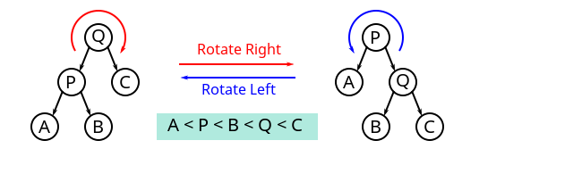

# AVL (balance binary search tree)
> 自平衡二叉搜索树

## 二叉树的旋转操作

实现一个 AVL, 需要了解[树旋转](https://zh.wikipedia.org/wiki/%E6%A0%91%E6%97%8B%E8%BD%AC)和树平衡

> 树旋转 wikipedia 的定义是对二叉树的一种操作, 不影响元素的顺序(二叉树的中序遍历的结果), 但是会改变树的结构, **将一个结点上移, 一个结点下移**。
> 树的旋转会改变树的形状, 因此长被用来将**较小的子树下移, 较大的子树上移**, 从而降低树的高度、提升许多树的操作效率(主要是查找效率)。




对一棵树进行旋转时, 这棵树的根节点是被旋转的两棵子树的父节点, 称为旋转时的根(**Root**); 如果结点在旋转之后称为新的父结点, 则称该结点为旋转是的转轴(**Pivot**)。上图中, 树的右旋操作以 Q 为根, P 为转轴, 会将树顺时针旋转。 相应的逆操作为左旋, 会以 Q 为转轴, 将树根逆时针旋转。


理解树旋转过程的关键, 在于理解其中不变的约束。 旋转操作不会导致叶子结点的顺序改变(**可以理解为旋转操作前后, 树的中序遍历的结果是一致的**), 旋转过程中也是始终受到二叉搜索树的性质约束: **右子节点比父节点大, 左子节点比父节点小**。尤其需要注意的是, 进行右旋时, 旋转前根节点的左节点的右结点会变成根节点的左结点, 根本身则在旋转后变成新的根的右结点(看下面的动图理解(**β结点**)), 而在这一过程中, 整棵树一直遵守前面提到的约束。相反的左旋操作也是一样的逻辑。


> golang 是实现二叉树的右旋操作


```go

type (
    AVLTree struct {
        Left  *AVLTree
        Right *AVLTree
        Value int64
    }
)

/******************************************************************************
*           d               b
*          /               / \
*         b       == >    a   d
*        / \                 /
*       a   c               c
* 
* 二叉树的右旋转操作
*******************************************************************************/

// 二叉树的右旋操作
// AVL 树旋转操作之后, 需要调整树当前树为根节点的高度
//
func (root *AVLTree) RightRotation() *AVLTree {
    if root == nil {
        return root
    }
    
    pivot := root.Left
    beta := pivot.Right
    pivot.Right = root
    root.Left = beta
    
    return pivot
}


```


二叉树旋转操作不改变二叉树的**中序**遍历的顺序


树的左右旋转还可以进行组合执行, 称为双旋转(double rotation)。

* 将 X 的右子树右旋, 再将 X 本身左旋, 就是 X 的双左旋转。
* 将 X 的左子树左旋, 再将 X 本身右旋, 就是 X 的双右旋转。


> 二叉树的双左旋转操作

```go
type (
    AVLTree struct {
        Left  *AVLTree
        Right *AVLTree
        Value int64
    }
)

/******************************************************************************
*           d               b
*          /               / \
*         b       == >    a   d
*        / \                 /
*       a   c               c
*
* 二叉树的右旋转操作
*******************************************************************************/

// 二叉树的右旋操作
// AVL 树旋转操作之后, 需要调整树当前树为根节点的高度
//
func (root *AVLTree) RightRotation() *AVLTree {
    if root == nil {
        return root
    }
    
    pivot := root.Left
    beta := pivot.Right
    pivot.Right = root
    root.Left = beta
    
    return pivot
}

/******************************************************************************
*           a               c
*            \             / \
*             c    == >   a   d
*            / \           \
*           b   d           b
*
* 二叉树的左旋转操作
*******************************************************************************/

// 二叉树的左旋操作
// AVL 树旋转操作之后, 需要调整树当前树为根节点的高度
//
func (root *AVLTree) LeftRotation() *AVLTree {
    if root == nil {
        return root
    }
    
    pivot := root.Right
    beta := pivot.Left
    pivot.Left = root
    root.Right = beta
    
    return pivot
}

/******************************************************************************
*           d               d                 c
*          /               /                 / \
*         d       == >    c        =>       b   d
*          \             /
*           c           b
*
* 二叉树的双左旋转操作
*******************************************************************************/

func (root *AVLTree) LeftRightRotation() *AVLTree {
    if root == nil {
        return root
    }
    root.Left = root.Left.LeftRotation()
    
    //root.RightRotation()
    //return root
    return root.RightRotation()
}

```

> 还有一个双右旋操作的


## AVL 的定义

[avl维基百科](https://zh.wikipedia.org/wiki/AVL%E6%A0%91)


AVL 树时最早被发明的**自平衡二叉查找树**。 在 AVL 树中, 任一个结点对应的两棵子树的最大高度差为 1, 因此它被称为高度平衡二叉树。查找、插入和删除在平均和最坏的时间复杂度都是 O(log n) `1.44 * O(log n)`。增加和删除元素的操作可能许哟啊借由一次或者多次的树旋转, 以实现树的重新平衡, 就是 👆 的代码。


## 外部链接

* [维基百科 avl](https://zh.wikipedia.org/wiki/AVL%E6%A0%91)