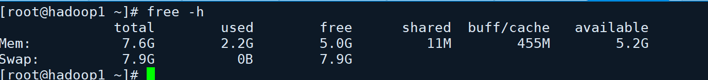

# 使用 linux 命令排查问题之 free

## 问题起因

linux 主机给的内存还是挺多的, 怎么这么卡呢? linux 有什么命令可以看内存的情况嘛? 假装使用 [百度一下](https://www.baidu.com/s?wd=linux如何查看内存使用情况的命令), 答案还是挺多的, 有 `free`, `vmstat`, `dstat` 等等

但是, 这次我们使用 `free` 来辅佐排查问题



|      | total        | used           | free           | shared       | buff/cache | available            |
| ---- | ------------ | -------------- | -------------- | ------------ | ---------- | -------------------- |
| Mem  | 可用物理内存 | 已使用物理内存 | 未使用物理内存 | 共享物理内存 |            | 应用程序可用物理内存 |
| Sawp | 交换空间大小 | 已使用交换空间 | 未使用交换空间 | 共享交换内存 |            | 应用程序可用交换内存 |

图中可以看到

1. 物理内存一共: 7.6GB, 已经使用: 2.2GB, 未使用: 5.0GB, 可用: 5.2GB

   但是, 用于交换的内存 一共 7.9GB

## 关闭内存交换

### 查看分区的挂载情况

`cat /etc/fstab` 查看磁盘分区的挂载情况

> 注释图中的第 12 行


执行

> 内核参数vm.swappiness控制换出运行时内存的相对权重，参数值大小对如何使用swap分区有很大联系。值越大，表示越积极使用swap分区，越小表示越积极使用物理内存。默认值swappiness=60，表示内存使用率超过100-60=40%时开始使用交换分区。swappiness=0的时候表示最大限度使用物理内存，然后才是 swap空间；swappiness＝100的时候表示积极使用swap分区，并把内存上的数据及时搬运到swap空间。（网上有的说，对于3.5以后的内核和RedHat 2.6.32之后的内核，设置为0会禁止使用swap，从而引发out of memory，这种情况可以设置为1。）

将 `vm.swappiness=0` 表示积极使用物理内存

``` shell
echo vm.swappiness=0 >> /etc/sysctl.conf
sudo reboot
```

再次执行 `free -h` 验证 swap 的内存情况
