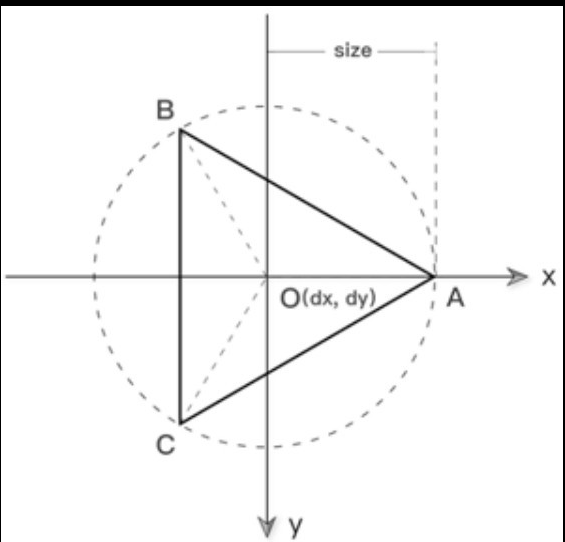

# canvas 绘制正多边形



``` vue3
<template>
    <div>
        <!-- canvas 容器 -->
        <canvas id="canvas-polygon" width="200" height="200" style="border: 1px dashed orange" @click="drawPolygon">
        </canvas>
    </div>
</template>
<script setup lang="ts">
// 封装公用函数, 返回 HTMLCanvasElement 对象
const $$ = (id: string): HTMLCanvasElement => {
    return document.getElementById(id) as HTMLCanvasElement;
};

const drawPolygon = () => {
    const canvas = $$("canvas-polygon");
    const ctx = canvas.getContext("2d");
    if (ctx == null) {
        return;
    }

    //
    createPolygon(ctx, 27, 100, 100, 50);
    ctx.fillStyle = "hotPink";
    ctx.fill();
    ctx.stroke();
};

/**
 *
 * @param ctx CancasRenderingContext2D 对象, 用于绘图
 * @param n  表示绘制 n 边形
 * @param dx 表示 n 边形的中心 x 坐标
 * @param dy 表示 n 变形的 y 轴中心坐标
 * @param size 表示 n 变形的大小
 */
const createPolygon = (
    ctx: CanvasRenderingContext2D,
    n: number,
    dx: number,
    dy: number,
    size: number
) => {
    ctx.beginPath();

    // 计算度数
    let degree = (2 * Math.PI) / n;
    console.log(degree, n);
    for (let i = 0; i < n; i++) {
        let x = Math.cos(i * degree);
        let y = Math.sin(i * degree);
        ctx.lineTo(x * size + dx, y * size + dy);
    }
    ctx.closePath();
};
</script>
<style scoped>

</style>

```
