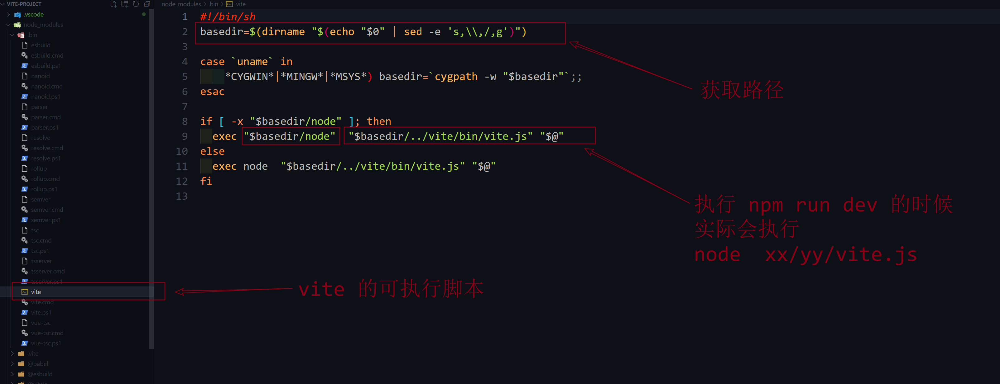

# npm run dev 项目是怎么跑起来的

一般来说, 前端项目直接使用 `npm run dev` 的方式跑起来, 但是是怎么跑起来的呢?

``` shell
npm run dev
```

## npm run dev 的执行过程

``` shell
npm run dev
```


项目的 `package.json` 文件的内容如下

``` json
{
  "name": "vite-project",
  "private": true,
  "version": "0.0.0",
  "type": "module",
  "scripts": {
    "dev": "vite",
    "build": "vue-tsc --noEmit && vite build",
    "preview": "vite preview"
  },
  "dependencies": {
    "vue": "^3.2.37"
  },
  "devDependencies": {
    "@vitejs/plugin-vue": "^3.1.0",
    "typescript": "^4.6.4",
    "vite": "^3.1.0",
    "vue-tsc": "^0.40.4"
  }
}
```

当我们执行 `npm run dev` 的时候呢? 其实就是运行 `vite` 命令 , 但是, 我们并无法直接执行 `vite` 命令, 因为, 我们, 没有将 `vite` 配置到环境变量里面去, 但是为什么 

npm run dev 就能执行 vite 命令呢? 

原来啊, 在我们执行 `npm install ` 命令的时候, npm 会在 `node_modules/.bin` 创建好了可执行文件的 `.bin` 目录, 这个目录不是任何一个 npm 的包, 目录下面的文件, 表示各种可执行命令的脚本,



在这里, `npm run dev` 实际上就是底层就是会执行 `node xx/yy/zz/vite.js` 这个命令, 这里的 vite.js 是在 `package.json` 文件中声明好的依赖文件, 在执行 `npm install ` 的之后下载的

