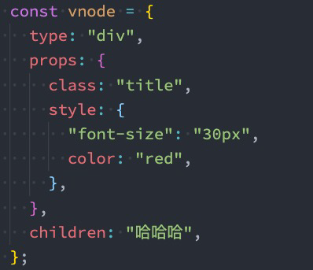
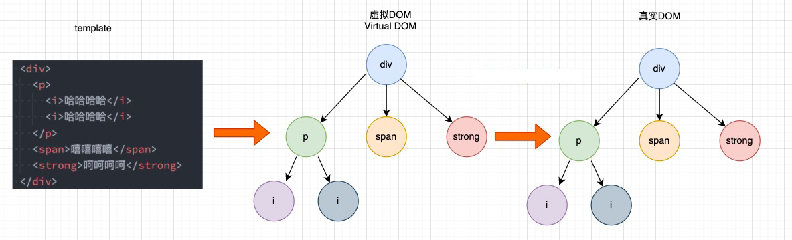
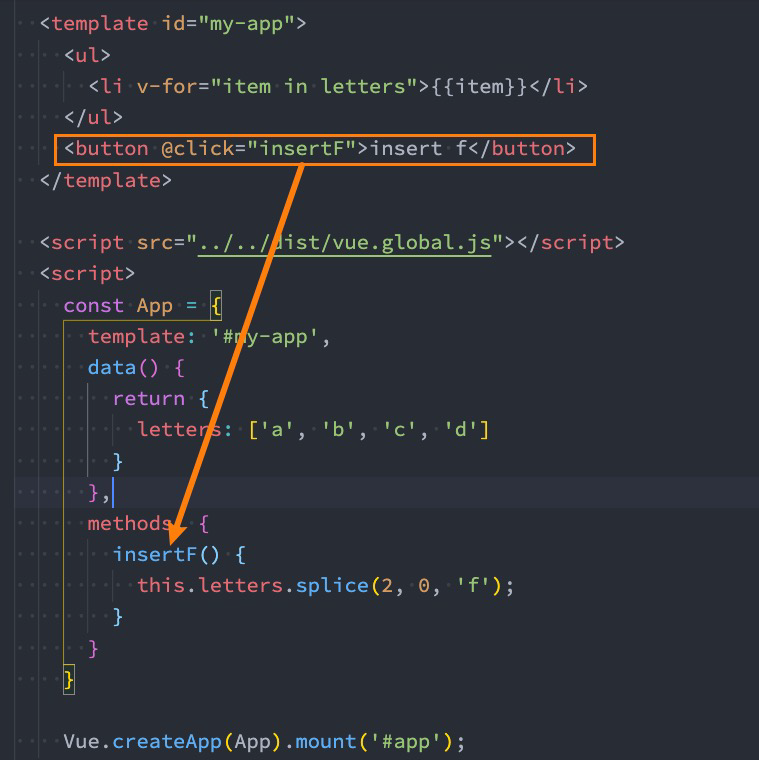
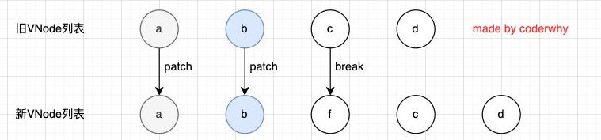
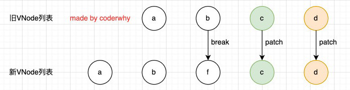
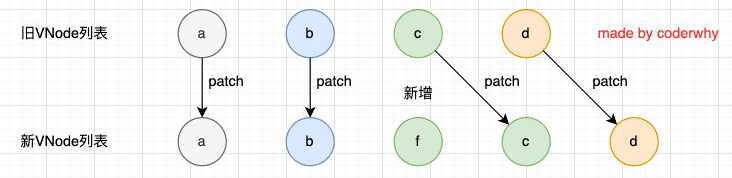
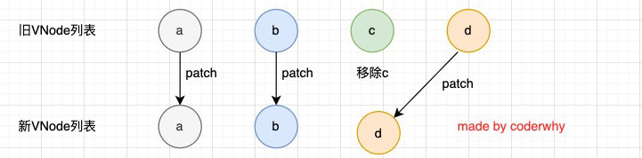
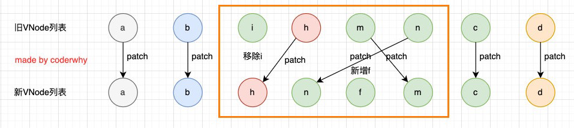

# vue 中的虚拟 dom 原理, 双端 diff 算法

一个 vue 文件是怎么变成 html 中的元素的呢?

``` vue
<template>
    <div>
        <div>
            <section>通过节点来渲染</section>
            <div>我是一个div 节点</div>
            <div>
                <p> 我是一个 p 标签</p>
            </div>
        </div>
    </div>
</template>
<script setup lang="ts">

</script>
<style scoped>

</style>
```

上面代码中,  `template` 标签下的代码会转为 虚拟 dom

``` html
<div>
    <div>
        <section>通过节点来渲染</section>
        <div>我是一个div 节点</div>
        <div>
            <p> 我是一个 p 标签</p>
        </div>
    </div>
</div>
```

然后, vue 会将这一部分的标签转为下面的 JS 代码, 就是生成 AST 的语法树

``` js
import { createElementVNode as _createElementVNode, openBlock as _openBlock, createElementBlock as _createElementBlock } from "vue"

export function render(_ctx, _cache, $props, $setup, $data, $options) {
  return (_openBlock(), _createElementBlock("div", null, [
    _createElementVNode("div", null, [
      _createElementVNode("section", null, "通过节点来渲染"),
      _createElementVNode("div", null, "我是一个div 节点"),
      _createElementVNode("div", null, [
        _createElementVNode("p", null, " 我是一个 p 标签")
      ])
    ])
  ]))
}
```

我们可以在这里查看这个例子 [Vue3 template exporter](https://vue-next-template-explorer.netlify.app/#eyJzcmMiOiI8ZGl2PlxyXG5cdDxkaXY+XHJcblx0XHQ8c2VjdGlvbj7pgJrov4foioLngrnmnaXmuLLmn5M8L3NlY3Rpb24+XHJcblx0XHQ8ZGl2PuaIkeaYr+S4gOS4qmRpdiDoioLngrk8L2Rpdj5cclxuXHRcdDxkaXY+XHJcblx0XHRcdDxwPiDmiJHmmK/kuIDkuKogcCDmoIfnrb48L3A+XHJcblx0XHQ8L2Rpdj5cclxuXHQ8L2Rpdj5cclxuPC9kaXY+Iiwib3B0aW9ucyI6e319)

## vnode

什么是 vNode 呢?

VNode 是 virtual Node, 也就是虚拟节点, 实际上, 无论是组件还是元素, 在 vue 中都是一个个的 vnode 节点, vnode 本质上还是一个javascript 的对象

1. vnode 全称是 virtual node, 也就是虚拟节点

2. 无论是组件还是组件还是元素, 在 vue 中的表现形式就是一个个的 vnode 节点

3. vnode 本质上就是一个 javascript 对象

   比如,

   ``` html
   <div class="title" style="font-size: 30px; color:red" > 哈哈哈 </div>
   ```

   那么,  vnode 为

   ``` javascript
   const vnode = {
       type:"div",
       props: {
           class: "title",
           sytle: {
               "font-size": "30px",
               color:"red",
           }
       },
       childred: "哈哈哈"
   }
   ```

## 

vue 文件中的 template 经过 vue 编译之后编程一个一个 vnode 节点 最后拼成真的的 dom

## 

将 vnode 对象中的所有节点以树的方式展开来, 形成 vnode 树结构, 我们称之为 虚拟 dom

如果 template 元素写得更加复杂,  比如

```html
<div>
    <p>
        <i>哈哈哈哈</i>
        <i>哈哈哈哈</i>
    </p>
    <span>嘻嘻嘻嘻</span>
    <strong>呵呵呵呵</strong>
</div>
```



这样, 复杂的 元素就会生成一个复杂的 虚拟 Dom 树, 这样做的好处是, 抽象了html 元素, 对于 dom 元素进行操作就能映射到 html 元素的更改

## 在 Vue 中, 对于元素的变更会怎么操作?



这里, dom 节点中, 包含了一个 ul 和一个 button 元素, 其中, ul 中包含了一个 li 列表, 点击 button 按钮会触发一次 `insertF` , 对于这个操作, 不需要更新整个 ul 和 button 元素

1. 在 vue 中, 对于相同的元素和子节点并不会重新渲染整个列表
2. 因为对于列表 a, b, c, d 他们都没有发生变化
3. 在操作真正的 dom 的时候, 我们只需要在中间插入一个 f 的 li vnode 就可以了

对于在列表中更新元素, 在 vue 中是怎么解决的呢?

vue 对于有 key 的元素和没有key 的元素会调用两种不同的方式

1. 对于有 key 的元素, 调用 [patchKeyedChildren](https://github.com/vuejs/core/blob/3.2/packages/runtime-core/src/renderer.ts#L1837) 函数进行处理
2. 对于没有key 的元素, 调用 [patchUnkeyedChildren](https://github.com/vuejs/core/blob/3.2/packages/runtime-core/src/renderer.ts#L1777) 函数处理变更的元素, 如果元素没有key, 简单暴力, 全部重新 patch, 然后多余的就节点全部移除, 新增的节点直接添加

``` typescript
  // can be all-keyed or mixed
  const patchKeyedChildren = (
    c1: VNode[],
    c2: VNodeArrayChildren,
    container: RendererElement,
    parentAnchor: RendererNode | null,
    parentComponent: ComponentInternalInstance | null,
    parentSuspense: SuspenseBoundary | null,
    isSVG: boolean,
    slotScopeIds: string[] | null,
    optimized: boolean
  ) => {
    let i = 0
    const l2 = c2.length
    let e1 = c1.length - 1 // prev ending index
    let e2 = l2 - 1 // next ending index

    // 1. sync from start
    // (a b) c
    // (a b) d e
    // 从头开始遍历元素, 遇到相同的元素就继续, 如果元素不相同就跳出循环
    while (i <= e1 && i <= e2) {
      const n1 = c1[i]
      const n2 = (c2[i] = optimized
        ? cloneIfMounted(c2[i] as VNode)
        : normalizeVNode(c2[i]))
      if (isSameVNodeType(n1, n2)) {
        patch(
          n1,
          n2,
          container,
          null,
          parentComponent,
          parentSuspense,
          isSVG,
          slotScopeIds,
          optimized
        )
      } else {
        break
      }
      i++
    }

    // 2. sync from end
    // a (b c)
    // d e (b c)
      // 从尾部开始编译, 遇到相同的节点就继续, 如果节点不相同就跳出循环
    while (i <= e1 && i <= e2) {
      const n1 = c1[e1]
      const n2 = (c2[e2] = optimized
        ? cloneIfMounted(c2[e2] as VNode)
        : normalizeVNode(c2[e2]))
      if (isSameVNodeType(n1, n2)) {
        patch(
          n1,
          n2,
          container,
          null,
          parentComponent,
          parentSuspense,
          isSVG,
          slotScopeIds,
          optimized
        )
      } else {
        break
      }
      e1--
      e2--
    }

    // 3. common sequence + mount
    // (a b)
    // (a b) c
    // i = 2, e1 = 1, e2 = 2
    // (a b)
    // c (a b)
    // i = 0, e1 = -1, e2 = 0
     // 如果新的节点更加多, 那么就添加新的节点 
    if (i > e1) {
      if (i <= e2) {
        const nextPos = e2 + 1
        const anchor = nextPos < l2 ? (c2[nextPos] as VNode).el : parentAnchor
        while (i <= e2) {
          patch(
            null,
            (c2[i] = optimized
              ? cloneIfMounted(c2[i] as VNode)
              : normalizeVNode(c2[i])),
            container,
            anchor,
            parentComponent,
            parentSuspense,
            isSVG,
            slotScopeIds,
            optimized
          )
          i++
        }
      }
    }

    // 4. common sequence + unmount
    // (a b) c
    // (a b)
    // i = 2, e1 = 2, e2 = 1
    // a (b c)
    // (b c)
    // i = 0, e1 = 0, e2 = -1
      // 如果旧的节点更加多, 那么就删除旧的节点
    else if (i > e2) {
      while (i <= e1) {
        unmount(c1[i], parentComponent, parentSuspense, true)
        i++
      }
    }

    // 5. unknown sequence
    // [i ... e1 + 1]: a b [c d e] f g
    // [i ... e2 + 1]: a b [e d c h] f g
    // i = 2, e1 = 4, e2 = 5
     // 如果中间存在不知道如何处理的节点序列, 那么, 就使用 key 建立索引图,尽最大可能使用旧节点
     // 如果有多余的节点啊, 那么就移除多余的节点, 这里 key 就排上用场了, 先要判断有没有相同 key 的节点, 有就复用
    else {
      const s1 = i // prev starting index
      const s2 = i // next starting index

      // 5.1 build key:index map for newChildren
      const keyToNewIndexMap: Map<string | number, number> = new Map()
      for (i = s2; i <= e2; i++) {
        const nextChild = (c2[i] = optimized
          ? cloneIfMounted(c2[i] as VNode)
          : normalizeVNode(c2[i]))
        if (nextChild.key != null) {
          if (__DEV__ && keyToNewIndexMap.has(nextChild.key)) {
            warn(
              `Duplicate keys found during update:`,
              JSON.stringify(nextChild.key),
              `Make sure keys are unique.`
            )
          }
          keyToNewIndexMap.set(nextChild.key, i)
        }
      }

      // 5.2 loop through old children left to be patched and try to patch
      // matching nodes & remove nodes that are no longer present
      let j
      let patched = 0
      const toBePatched = e2 - s2 + 1
      let moved = false
      // used to track whether any node has moved
      let maxNewIndexSoFar = 0
      // works as Map<newIndex, oldIndex>
      // Note that oldIndex is offset by +1
      // and oldIndex = 0 is a special value indicating the new node has
      // no corresponding old node.
      // used for determining longest stable subsequence
      const newIndexToOldIndexMap = new Array(toBePatched)
      for (i = 0; i < toBePatched; i++) newIndexToOldIndexMap[i] = 0

      for (i = s1; i <= e1; i++) {
        const prevChild = c1[i]
        if (patched >= toBePatched) {
          // all new children have been patched so this can only be a removal
          unmount(prevChild, parentComponent, parentSuspense, true)
          continue
        }
        let newIndex
        if (prevChild.key != null) {
          newIndex = keyToNewIndexMap.get(prevChild.key)
        } else {
          // key-less node, try to locate a key-less node of the same type
          for (j = s2; j <= e2; j++) {
            if (
              newIndexToOldIndexMap[j - s2] === 0 &&
              isSameVNodeType(prevChild, c2[j] as VNode)
            ) {
              newIndex = j
              break
            }
          }
        }
        if (newIndex === undefined) {
          unmount(prevChild, parentComponent, parentSuspense, true)
        } else {
          newIndexToOldIndexMap[newIndex - s2] = i + 1
          if (newIndex >= maxNewIndexSoFar) {
            maxNewIndexSoFar = newIndex
          } else {
            moved = true
          }
          patch(
            prevChild,
            c2[newIndex] as VNode,
            container,
            null,
            parentComponent,
            parentSuspense,
            isSVG,
            slotScopeIds,
            optimized
          )
          patched++
        }
      }

      // 5.3 move and mount
      // generate longest stable subsequence only when nodes have moved
      const increasingNewIndexSequence = moved
        ? getSequence(newIndexToOldIndexMap)
        : EMPTY_ARR
      j = increasingNewIndexSequence.length - 1
      // looping backwards so that we can use last patched node as anchor
      for (i = toBePatched - 1; i >= 0; i--) {
        const nextIndex = s2 + i
        const nextChild = c2[nextIndex] as VNode
        const anchor =
          nextIndex + 1 < l2 ? (c2[nextIndex + 1] as VNode).el : parentAnchor
        if (newIndexToOldIndexMap[i] === 0) {
          // mount new
          patch(
            null,
            nextChild,
            container,
            anchor,
            parentComponent,
            parentSuspense,
            isSVG,
            slotScopeIds,
            optimized
          )
        } else if (moved) {
          // move if:
          // There is no stable subsequence (e.g. a reverse)
          // OR current node is not among the stable sequence
          if (j < 0 || i !== increasingNewIndexSequence[j]) {
            move(nextChild, container, anchor, MoveType.REORDER)
          } else {
            j--
          }
        }
      }
    }
  }
```

### 有 key 的 diff 算法如下

新的 vnode 节点列表: [a, b, f, c, d]

旧的 vode 节点列表: [a, b, c, d]

1. 第一步, 操作从节点的头部开始

   * 节点 a 和 节点 b 是一致的, 继续比较
   * c 和 f 的 key 不一致, 直接走 break

   

2. 第二步, 操作从节点列表的尾部开始

   * 比较 节点 d 和节点 d, 一致, 继续

   * 比较节点 c 和 节点 c, 一致, 继续

   * 比较节点 f 和节点 b, 不一致, 跳出循环

     

3. 第三步, 如果旧节点遍历完毕, 但是依然有新节点, 那么直接新增节点

   

4. 第四步, 如果新增节点列表遍历完毕, 依然有旧节点, 那么就移除旧节点

   

5. 第五步, 如果上诉步骤都走完了, 还有一些不确定顺序的节点(乱序的节点)

   

   * vue 会判断是否有存在 key 一致, 如果一致重用, 如果不一致, 尽可能运用已有的节点
   * 旧节点比新增节点多, 移除多余的节点
   * 新增结点比旧节点多, 则新增节点

## 总结

1. vue 使用 vnode 来抽象 html 文档节点元素
2. 虚拟dom 是 vnode 节点展开的文档树结构
3. 对于有 key 的节点使用双端 diff 算法来提升节点的操作性能
4. 对于没有 key 的节点, 直接使用 for 循环的暴力算法
