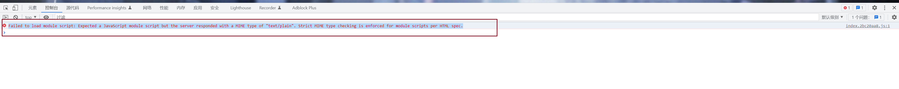

# 使用 vite 工具构建 vue 项目

## gin staticsFS 解析时, 前端报错

```shell
Failed to load module script: Expected a JavaScript module script but the server responded with a MIME type of "text/plain". Strict MIME type checking is enforced for module scripts per HTML spec.
```



**[解决问题参考 issue](https://github.com/gin-gonic/gin/issues/1595)**\_

加入核心代码: `mime.AddExtensionType(".js", "application/javascript")`

```golang

package main

import (
 "mime"
 "net/http"

 "github.com/gin-gonic/gin"
 "github.com/go-resty/resty/v2"
 "github.com/sirupsen/logrus"
)

func init() {
}

var (
 covidUrl = "https://api.inews.qq.com/newsqa/v1/query/inner/publish/modules/list?modules=localCityNCOVDataList,diseaseh5Shelf"
)

func Cors() gin.HandlerFunc {
 return func(context *gin.Context) {
  method := context.Request.Method

  context.Header("Access-Control-Allow-Origin", "*")
  context.Header("Access-Control-Allow-Headers", "Content-Type,AccessToken,X-CSRF-Token, Authorization, Token, x-token")
  context.Header("Access-Control-Allow-Methods", "POST, GET, OPTIONS, DELETE, PATCH, PUT")
  context.Header("Access-Control-Expose-Headers", "Content-Length, Access-Control-Allow-Origin, Access-Control-Allow-Headers, Content-Type")
  context.Header("Access-Control-Allow-Credentials", "true")

  if method == "OPTIONS" {
   context.AbortWithStatus(http.StatusNoContent)
  }
 }
}

func main() {
 engine := gin.Default()
 engine.Use(Cors())
 engine.StaticFS("/assets", http.Dir("exmaples/covid19/dist/assets"))
 // chrome新版对type=module的script的content-type有严格要求
 mime.AddExtensionType(".js", "application/javascript")

 engine.LoadHTMLGlob("exmaples/covid19/dist/index.html") //解析
 engine.GET("/index", func(c *gin.Context) {
  c.HTML(http.StatusOK, "index.html", gin.H{})
 })
 engine.GET("/api/list", func(ctx *gin.Context) {
  client := resty.New() // 创建一个restry客户端
  var data = make(map[string]interface{}, 0)
  _, err := client.R().SetResult(&data).EnableTrace().Get(covidUrl)
  if err != nil {
   logrus.Error("error ", err)

  }
  ctx.JSON(200, data["data"])
 })

 if err := engine.Run("0.0.0.0:30000"); err != nil {
  logrus.Fatal("start server error ", err)
 }
}

```
