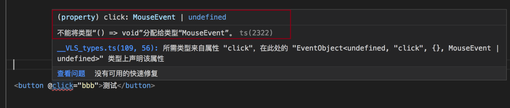

# 不能将类型 `($event: any) =＞ void` 分配给类型`MouseEvent`

node: 14.17.6
tsc: 4.8.3
vite: vite/2.8.1 win32-x64 node-v14.17.6

```bash
npm run build
```

报错: 不能将类型 `($event: any) =＞ void` 分配给类型`MouseEvent`

具体报错如下:



解决如下: 更新对应的 node 版本的类型声明 `@types/node@14.17.6` 这里的 `14.17.6` 是我环境上对应的 node 的版本

```shell
npm install -D -S @types/node@14.17.6
```

[解决问题参考](https://blog.csdn.net/m_uncle/article/details/127285662)
