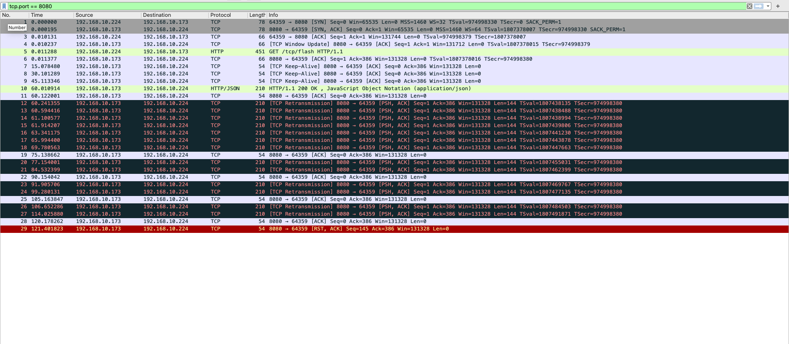

# TCP 闪断试验

> 工具: golang, wireshark, 路由器, 客户端(手机)

## 楼起 
提问: 链接中的 TCP，突然有一方断开了链接，被断开的那一方会怎么处理？

选项: 1. 直接发送 RST 包
选项: 2. 重传，最后发送 RST 包
选项: 3. 。。。

> 简单的测试程序片段

```go
engine.GET("/tcp/flash", func(ctx *gin.Context) {
    time.Sleep(time.Minute) // 睡眠 1 分钟再返回
    ctx.JSON(200, gin.H{"desc": ctx.Request.RequestURI})
})
```
## 峰回 -- 有疑问的地方必然有答案
想要了解突然断开了之后会发送什么❓最好的方法就是动手实验了。 


以下是具体步骤: 
1. 启动 wireshark 进行抓包
2. 启动服务器
3. 客户端进行链接
4. 客户端断开网络链接(客户端手动断开网络链接)

抓包结果:


分析:  192.168.10.224 是客户端,  192.168.10.173 是服务器

- 序号 1, 2, 3 是 TCP 的三次握手包
- 序号 4 是服务器更新窗口大小的包
- 序号 5 是客户端发起一个 HTTP 请求的包
- 序号 6 是服务器向客户端回复的 ACK 包
- 序号 7，8，9 是服务器向客户端发送的 keep-Alive 包
- 序号 10 是 HTTP 响应体的包
- 序号 12，13，14，15，16，18，18 是超时重传包

## 落定

1. 在服务端睡眠的过程中, TCP 会发送 keep-alive 包来保活
2. 在客户端拔网线之后，会触发 TCP 的超时重传机制, 服务器在经过一定的超时重传包之后，最后会发送一个 RST 的包

所以 TCP 链接中的双方有一方突然断开链接之后，当前的 TCP 就处于半链接的状态，触发 TCP 的超时重传机制，再多次重传没有收到回复之后，最后会发送 RST 包断开链接

[tcp闪断包 tcpdump 完整包](tcp_flash.pcapng),[完整的 go 代码](main.go)

最后: TCP 确实是一个让人又爱又恨的协议
